# O Fluxo Completo de Dados no Meteor: Do Cliente ao Servidor e Vice-Versa

## Introdução

O Meteor é conhecido por sua arquitetura de dados em tempo real que permite sincronização automática entre cliente e servidor. Neste guia completo, vamos analisar todo o fluxo de dados desde quando um cliente envia dados para o servidor até quando esses dados são distribuídos para todos os clientes conectados.

## Arquitetura Geral do Sistema

O Meteor utiliza uma arquitetura em camadas que inclui:

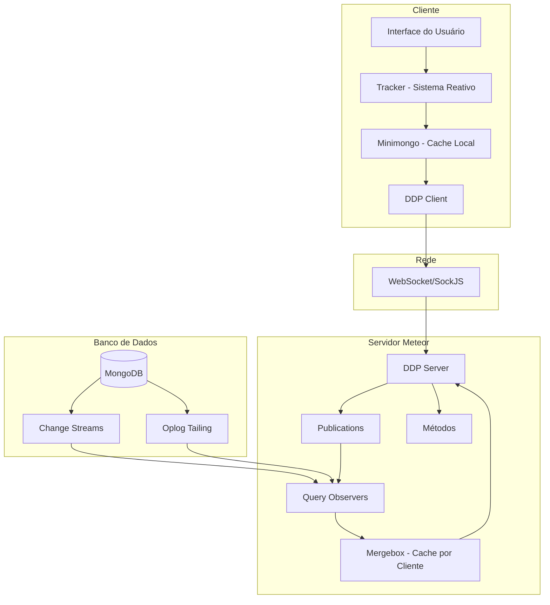

## 1. Camada do Cliente

### 1.1 Interface do Usuário (UI)

A interface do usuário é onde tudo começa. Quando um usuário interage com a aplicação (por exemplo, clica em um botão para adicionar um todo), a UI dispara uma ação que inicia o fluxo de dados.

#### Implementação Interna:

```javascript
// Exemplo de como a UI dispara o fluxo
// Em um componente React
const handleAddTodo = () => {
  // Esta chamada inicia todo o fluxo de dados
  Meteor.call('addTodo', { text: 'New todo' }, (error, result) => {
    if (error) {
      console.error('Error adding todo:', error);
    }
  });
};
```

### 1.2 Tracker - Sistema Reativo

O Tracker é o coração do sistema reativo do Meteor. Ele implementa **Programação Reativa Transparente**:

```javascript
// Exemplo de como o Tracker funciona
Tracker.autorun(() => {
  // Esta computação depende de fontes de dados reativas
  const user = Meteor.user();
  const todos = Todos.find({ userId: user?._id });
  
  // A UI atualiza automaticamente quando user ou todos mudam
  updateUI(todos.fetch());
});
```

#### Implementação Interna do Tracker:

```javascript
// Estrutura interna de uma Computation
class Computation {
  constructor(func, parentComputation, onError) {
    this._func = func;
    this._id = Tracker._nextId++;
    this.invalidated = false;
    this.stopped = false;
    this.firstRun = true;
    this._recomputing = false;
    this._onError = onError;
    
    // Dependências registradas durante execução
    this._dependentsById = Object.create(null);
    
    // Computação pai (para hierarquia)
    this.parentComputation = parentComputation;
    
    // Executa imediatamente
    this._compute();
  }

  _compute() {
    this.invalidated = false;
    
    // Salva computação atual
    const previousComputation = Tracker.currentComputation;
    Tracker.currentComputation = this;
    
    try {
      this._func(this);
    } finally {
      Tracker.currentComputation = previousComputation;
    }
  }

  invalidate() {
    if (!this.invalidated) {
      this.invalidated = true;
      Tracker._scheduleFlush();
    }
  }
}
```

#### Como o Tracker Funciona:

1. **Criação da Computação**: Quando você chama `Tracker.autorun()`, ele cria um objeto `Computation`
2. **Rastreamento de Dependências**: Durante a execução, fontes de dados reativas registram dependências
3. **Invalidação**: Quando os dados mudam, as dependências disparam invalidação da computação
4. **Recomputação**: Computações invalidadas automaticamente re-executam

#### Arquitetura do Tracker:


### 1.3 Minimongo - Cache Local do Cliente

Minimongo é uma implementação em JavaScript do MongoDB que roda no navegador. Ele serve como cache local dos dados:

#### Características Principais:

- **API Síncrona**: Queries retornam imediatamente do cache local
- **Compatibilidade MongoDB**: Mesma API do MongoDB do servidor
- **Atualizações Otimistas**: Mudanças aplicadas localmente primeiro, depois sincronizadas
- **Compensação de Latência**: Usuários veem mudanças instantaneamente

#### Implementação Interna do Minimongo:

```javascript
// Estrutura interna do LocalCollection
class LocalCollection {
  constructor(name) {
    this.name = name;
    // Mapeamento _id -> documento
    this._docs = new LocalCollection._IdMap;
    
    // Fila de observadores
    this._observeQueue = Meteor.isClient 
      ? new Meteor._SynchronousQueue()
      : new Meteor._AsynchronousQueue();
    
    // Gerador de IDs de query
    this.next_qid = 1;
    
    // qid -> objeto de query ativa
    this.queries = Object.create(null);
    
    // Para compensação de latência
    this._savedOriginals = null;
    this.paused = false;
  }

  // Implementação de find
  find(selector, options) {
    const cursor = new Cursor(this, selector, options);
    
    // Registra dependência reativa se dentro de computação
    if (Tracker.active) {
      cursor._depend();
    }
    
    return cursor;
  }

  // Implementação de insert
  insert(doc) {
    // Gera _id se não fornecido
    if (!doc._id) {
      doc._id = Random.id();
    }
    
    // Salva original para compensação de latência
    if (this._savedOriginals) {
      this._savedOriginals.set(doc._id, null);
    }
    
    // Insere no cache local
    this._docs.set(doc._id, EJSON.clone(doc));
    
    // Notifica observadores
    this._notifyObservers('added', doc._id, doc);
    
    return doc._id;
  }
}
```

#### Arquitetura do Minimongo:

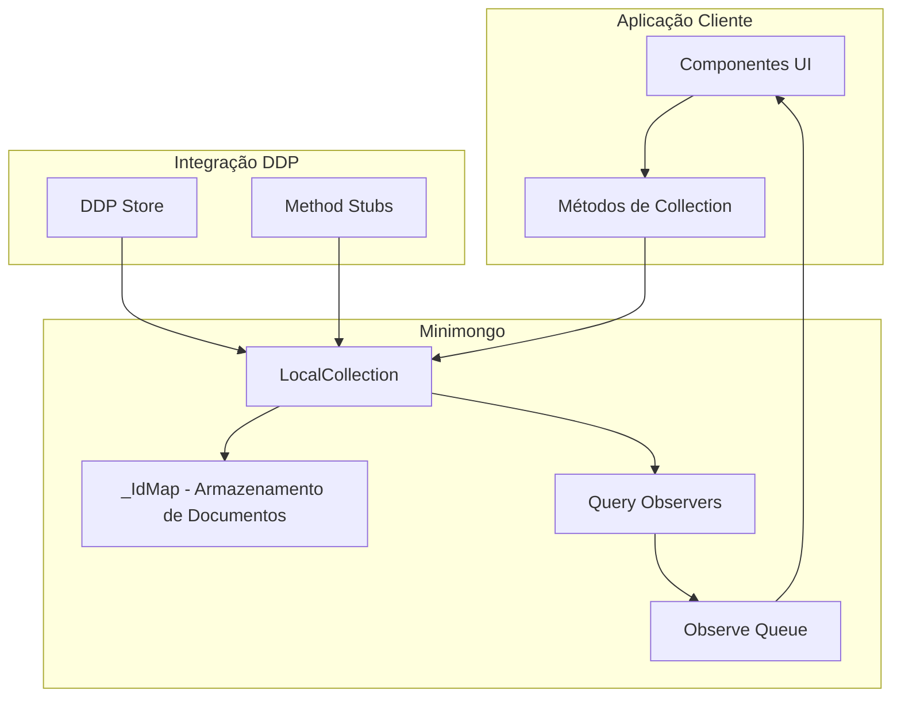

#### Fluxo de UI Otimista:

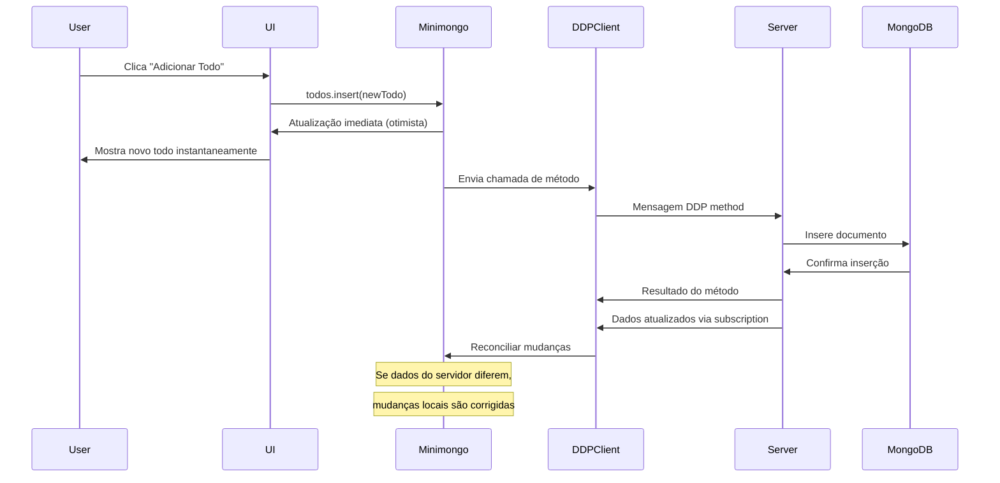

### 1.4 DDP Client

O DDP Client gerencia a comunicação com o servidor através do protocolo DDP (Distributed Data Protocol).

#### Implementação Interna do DDP Client:

```javascript
// Estrutura interna da Connection
class Connection {
  constructor(url, options) {
    this.url = url;
    this.options = options;
    
    // Estado da conexão
    this.connected = false;
    this.retryCount = 0;
    this.maxRetries = options.retryCount || 5;
    
    // Buffers para mensagens
    this._messagesBufferedUntilQuiescence = [];
    this._bufferedWrites = [];
    this._bufferedWritesInterval = options.bufferedWritesInterval || 0;
    
    // Contadores
    this._nextMethodId = 1;
    this._nextSubId = 1;
    
    // Handlers de mensagens
    this._messageProcessors = new MessageProcessors(this);
    this._connectionStreamHandlers = new ConnectionStreamHandlers(this);
    
    // Inicia conexão
    this._connect();
  }

  // Envia mensagem DDP
  _send(msg) {
    if (this.socket && this.socket.readyState === WebSocket.OPEN) {
      const message = DDPCommon.stringifyDDP(msg);
      this.socket.send(message);
    }
  }

  // Processa mensagem recebida
  async onMessage(raw_msg) {
    try {
      const msg = DDPCommon.parseDDP(raw_msg);
      await this._routeMessage(msg);
    } catch (error) {
      console.error('Error processing DDP message:', error);
    }
  }

  // Roteia mensagem para handler apropriado
  async _routeMessage(msg) {
    switch (msg.msg) {
      case 'connected':
        await this._livedata_connected(msg);
        this.options.onConnected();
        break;
      case 'added':
      case 'changed':
      case 'removed':
      case 'ready':
      case 'updated':
        await this._livedata_data(msg);
        break;
      case 'result':
        await this._livedata_result(msg);
        break;
      case 'ping':
        if (this.options.respondToPings) {
          this._send({ msg: 'pong', id: msg.id });
        }
        break;
    }
  }
}
```

## 2. Protocolo DDP - Comunicação em Tempo Real

DDP é o protocolo de comunicação em tempo real do Meteor que permite comunicação bidirecional entre cliente e servidor.

### 2.1 Tipos de Mensagens DDP

#### Mensagens de Subscription:
- `sub`: Cliente se inscreve em uma publicação
- `unsub`: Cliente cancela inscrição
- `ready`: Servidor indica que subscription está pronta
- `nosub`: Servidor indica que subscription parou

#### Mensagens de Dados:
- `added`: Documento foi adicionado à subscription
- `changed`: Documento foi modificado
- `removed`: Documento foi removido

#### Mensagens de Método:
- `method`: Cliente chama um método do servidor
- `result`: Servidor retorna resultado do método
- `updated`: Servidor confirma que todas as escritas estão completas

### 2.2 Exemplo de Fluxo DDP:

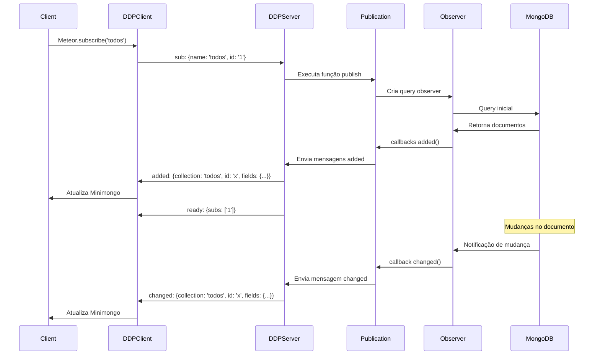

## 3. Camada do Servidor

### 3.1 DDP Server

O DDP Server é responsável por:

- Gerenciar conexões WebSocket
- Processar mensagens DDP
- Coordenar entre métodos e publicações
- Manter estado das conexões

#### Implementação Interna do DDP Server:

```javascript
// Estrutura interna do Server
class Server {
  constructor() {
    // Registro de handlers
    this.method_handlers = Object.create(null);
    this.publish_handlers = Object.create(null);
    
    // Sessões ativas
    this.sessions = new Map();
    
    // Stream server para WebSocket
    this.stream_server = new StreamServer();
    
    // Configura handlers de conexão
    this.stream_server.register(this._handleConnection.bind(this));
  }

  // Handler para nova conexão
  _handleConnection(socket) {
    socket._meteorSession = null;

    socket.on('data', (raw_msg) => {
      try {
        const msg = DDPCommon.parseDDP(raw_msg);
        
        if (msg.msg === 'connect') {
          this._handleConnect(socket, msg);
          return;
        }

        if (!socket._meteorSession) {
          this._sendError(socket, 'Must connect first', msg);
          return;
        }
        
        // Processa mensagem na sessão
        socket._meteorSession.processMessage(msg);
      } catch (e) {
        console.error('Error processing message:', e);
      }
    });

    socket.on('close', () => {
      if (socket._meteorSession) {
        socket._meteorSession.close();
      }
    });
  }

  // Processa mensagem de conexão
  _handleConnect(socket, msg) {
    const session = new Session(this, socket);
    socket._meteorSession = session;
    
    // Envia confirmação de conexão
    session.send({
      msg: 'connected',
      session: session.id
    });
  }

  // Envia erro para cliente
  _sendError(socket, reason, offendingMessage) {
    const msg = { msg: 'error', reason: reason };
    if (offendingMessage) {
      msg.offendingMessage = offendingMessage;
    }
    socket.send(DDPCommon.stringifyDDP(msg));
  }
}
```

### 3.2 Publications (Publicações)

Publicações são funções no servidor que definem quais dados enviar para cada cliente:

```javascript
// Exemplo de publicação
Meteor.publish('todos', function() {
  return Todos.find({ userId: this.userId });
});
```

#### Implementação Interna das Publications:

```javascript
// Estrutura interna da Subscription
class Subscription {
  constructor(session, id, name, params) {
    this.session = session;
    this.id = id;
    this.name = name;
    this.params = params;
    
    // Estado da subscription
    this.ready = false;
    this.stopped = false;
    
    // Observers ativos
    this._observers = [];
    
    // Cache de documentos por collection
    this._documents = new Map();
    
    // Inicia a publicação
    this._start();
  }

  // Inicia a publicação
  _start() {
    const handler = this.session.server.publish_handlers[this.name];
    if (!handler) {
      this.error(new Error(`Publication '${this.name}' not found`));
      return;
    }

    try {
      // Executa função da publicação
      const result = handler.call(this, ...this.params);
      
      if (result && result._cursorDescription) {
        // É um cursor - configura observer
        this._observeCursor(result);
      } else {
        // Publicação manual
        this.ready();
      }
    } catch (error) {
      this.error(error);
    }
  }

  // Observa cursor
  _observeCursor(cursor) {
    const observer = cursor.observe({
      added: (doc) => this.added(cursor._cursorDescription.collectionName, doc._id, doc),
      changed: (doc) => this.changed(cursor._cursorDescription.collectionName, doc._id, doc),
      removed: (doc) => this.removed(cursor._cursorDescription.collectionName, doc._id)
    });
    
    this._observers.push(observer);
  }

  // Adiciona documento
  added(collection, id, fields) {
    if (this.stopped) return;
    
    // Atualiza cache local
    if (!this._documents.has(collection)) {
      this._documents.set(collection, new Map());
    }
    this._documents.get(collection).set(id, fields);
    
    // Envia para cliente
    this.session.send({
      msg: 'added',
      collection: collection,
      id: id,
      fields: fields
    });
  }

  // Marca como pronta
  ready() {
    if (this.stopped) return;
    
    this.ready = true;
    this.session.send({
      msg: 'ready',
      subs: [this.id]
    });
  }

  // Para a subscription
  stop() {
    if (this.stopped) return;
    
    this.stopped = true;
    
    // Para observers
    this._observers.forEach(observer => observer.stop());
    
    // Remove documentos do cliente
    this._documents.forEach((docs, collection) => {
      docs.forEach((doc, id) => {
        this.session.send({
          msg: 'removed',
          collection: collection,
          id: id
        });
      });
    });
  }
}
```

### 3.3 Observers (Observadores)

Observers são responsáveis por detectar mudanças no banco de dados e notificar as publicações. O Meteor suporta três tipos de observers:

#### Implementação Interna dos Observers:

```javascript
// Estrutura base do Observer
class Observer {
  constructor(cursorDescription, callbacks) {
    this.cursorDescription = cursorDescription;
    this.callbacks = callbacks;
    this.stopped = false;
    
    // Cache de resultados
    this._results = new Map();
    
    // Inicia observação
    this._start();
  }

  // Para o observer
  stop() {
    this.stopped = true;
    this._cleanup();
  }

  // Limpa recursos
  _cleanup() {
    // Implementação específica de cada driver
  }
}

// OplogObserveDriver - Implementação padrão
class OplogObserveDriver extends Observer {
  constructor(options) {
    super(options.cursorDescription, options.callbacks);
    
    this._mongoHandle = options.mongoHandle;
    this._multiplexer = options.multiplexer;
    this._matcher = options.matcher;
    
    // Conecta ao oplog
    this._connectToOplog();
  }

  // Conecta ao oplog do MongoDB
  _connectToOplog() {
    const oplogHandle = this._mongoHandle._oplogHandle;
    
    // Registra para receber eventos do oplog
    oplogHandle.registerQuery(this.cursorDescription, (oplogEntry) => {
      this._processOplogEntry(oplogEntry);
    });
  }

  // Processa entrada do oplog
  _processOplogEntry(oplogEntry) {
    if (this.stopped) return;
    
    // Verifica se a operação afeta nossa query
    if (!this._matcher.matches(oplogEntry)) {
      return;
    }
    
    // Processa baseado no tipo de operação
    switch (oplogEntry.op) {
      case 'i': // insert
        this._handleInsert(oplogEntry);
        break;
      case 'u': // update
        this._handleUpdate(oplogEntry);
        break;
      case 'd': // delete
        this._handleDelete(oplogEntry);
        break;
    }
  }

  // Processa insert
  _handleInsert(oplogEntry) {
    const doc = oplogEntry.o;
    
    // Verifica se documento corresponde à query
    if (this._matcher.matches(doc)) {
      this.callbacks.added(doc);
    }
  }

  // Processa update
  _handleUpdate(oplogEntry) {
    const docId = oplogEntry.o2._id;
    const update = oplogEntry.o;
    
    // Busca documento atualizado
    this._mongoHandle.findOne(this.cursorDescription.collectionName, { _id: docId }, (err, doc) => {
      if (err || !doc) return;
      
      if (this._matcher.matches(doc)) {
        this.callbacks.changed(doc);
      } else {
        // Documento não corresponde mais à query
        this.callbacks.removed(docId);
      }
    });
  }

  // Processa delete
  _handleDelete(oplogEntry) {
    const docId = oplogEntry.o._id;
    this.callbacks.removed(docId);
  }
}

// ChangeStreamObserveDriver - Implementação moderna
class ChangeStreamObserveDriver extends Observer {
  constructor(options) {
    super(options.cursorDescription, options.callbacks);
    
    this._mongoHandle = options.mongoHandle;
    this._changeStream = null;
    
    // Inicia change stream
    this._startChangeStream();
  }

  // Inicia change stream
  async _startChangeStream() {
    try {
      const pipeline = [
        { $match: { 'fullDocument': { $exists: true } } }
      ];
      
      this._changeStream = this._mongoHandle.collection(this.cursorDescription.collectionName)
        .watch(pipeline, { fullDocument: 'updateLookup' });
      
      this._changeStream.on('change', (change) => {
        this._handleChange(change);
      });
      
      this._changeStream.on('error', (error) => {
        console.error('Change stream error:', error);
      });
    } catch (error) {
      console.error('Failed to start change stream:', error);
    }
  }

  // Processa mudança do change stream
  _handleChange(change) {
    if (this.stopped) return;
    
    const doc = change.fullDocument;
    
    switch (change.operationType) {
      case 'insert':
        if (this._matcher.matches(doc)) {
          this.callbacks.added(doc);
        }
        break;
      case 'update':
        if (this._matcher.matches(doc)) {
          this.callbacks.changed(doc);
        } else {
          this.callbacks.removed(doc._id);
        }
        break;
      case 'delete':
        this.callbacks.removed(change.documentKey._id);
        break;
    }
  }

  _cleanup() {
    if (this._changeStream) {
      this._changeStream.close();
    }
  }
}
```

#### 3.3.1 OplogObserveDriver (Padrão)

Usa o oplog do MongoDB para detectar mudanças em tempo real:

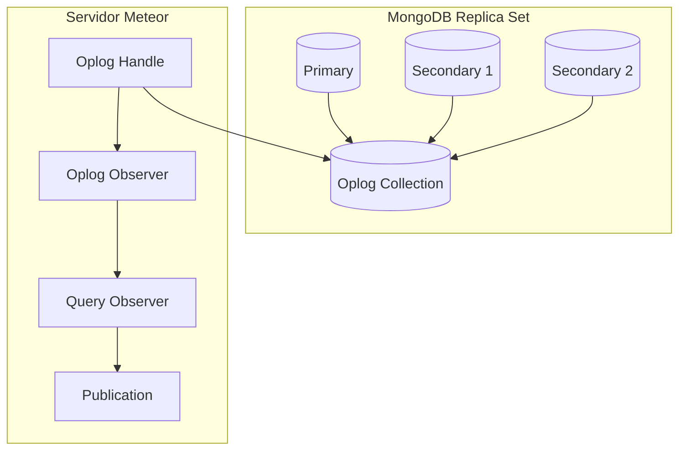

#### Fluxo de Processamento do Oplog:

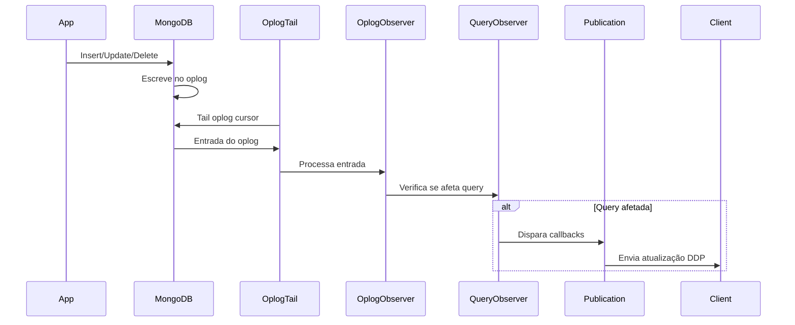

#### Processamento de Entrada do Oplog:

```javascript
// Exemplo de entrada do oplog para um insert
{
  "ts": ...,           // Timestamp
  "t": ...,            // Term
  "h": ...,            // Hash
  "v": 2,              // Versão
  "op": "i",           // Tipo de operação (i=insert, u=update, d=delete)
  "ns": "myapp.todos", // Namespace (database.collection)
  "o": {               // Documento da operação
    "_id": ObjectId("..."),
    "text": "New todo",
    "done": false
  }
}
```

#### 3.3.2 ChangeStreamObserveDriver

Recurso moderno do MongoDB (3.6+) que fornece notificações de mudanças em tempo real:

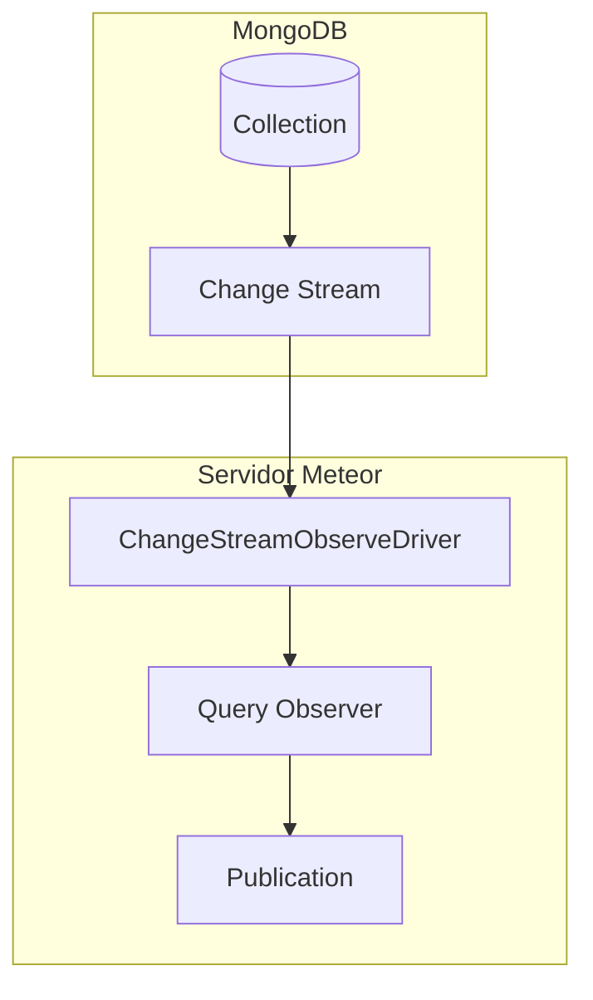

#### 3.3.3 PollingObserveDriver

Fallback que faz polling periódico do banco de dados:

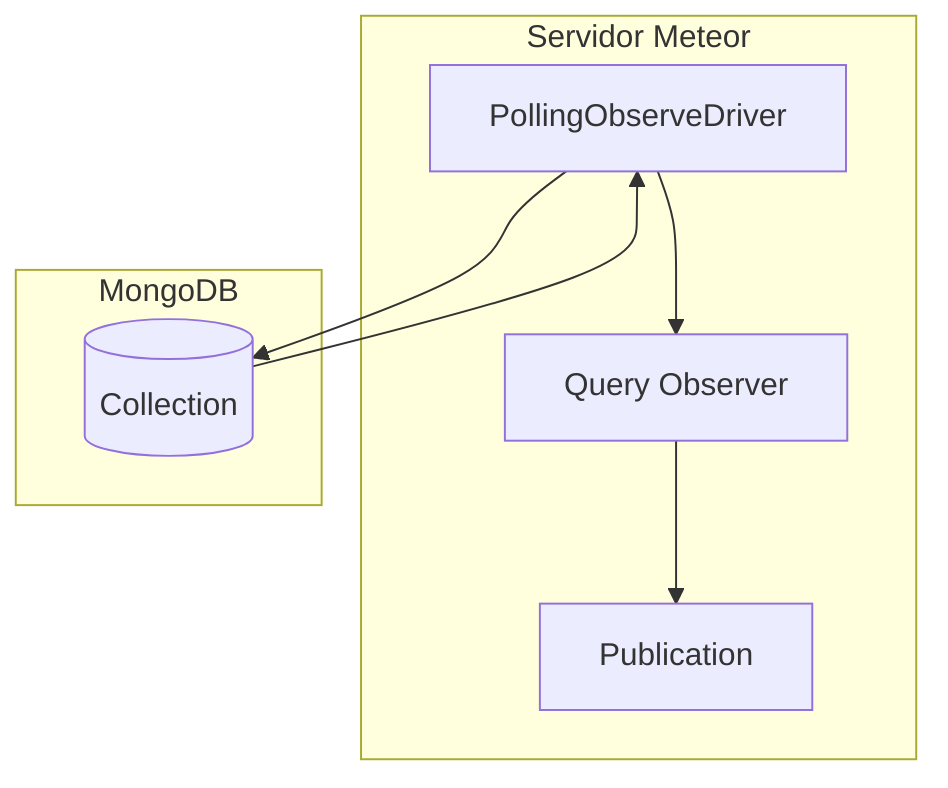

### 3.4 Mergebox - Cache por Cliente no Servidor

O Mergebox mantém um cache do que cada cliente recebeu, permitindo atualizações delta eficientes:

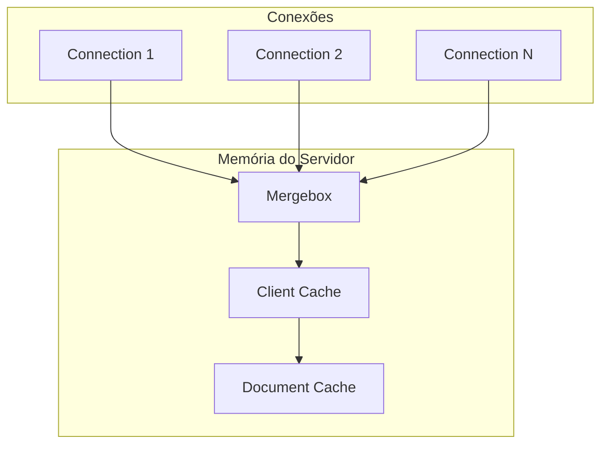

#### Implementação Interna do Mergebox:

```javascript
// Estrutura interna do Mergebox
class Mergebox {
  constructor(session) {
    this.session = session;
    
    // Cache por collection: collectionName -> Map<docId, docData>
    this._collections = new Map();
    
    // Contadores para debugging
    this._stats = {
      documents: 0,
      collections: 0,
      updates: 0
    };
  }

  // Adiciona documento ao cache
  addDocument(collectionName, docId, fields) {
    if (!this._collections.has(collectionName)) {
      this._collections.set(collectionName, new Map());
      this._stats.collections++;
    }
    
    const collection = this._collections.get(collectionName);
    const existingDoc = collection.get(docId);
    
    if (!existingDoc) {
      // Novo documento
      collection.set(docId, fields);
      this._stats.documents++;
    } else {
      // Atualiza documento existente
      Object.assign(existingDoc, fields);
      this._stats.updates++;
    }
  }

  // Remove documento do cache
  removeDocument(collectionName, docId) {
    const collection = this._collections.get(collectionName);
    if (collection && collection.has(docId)) {
      collection.delete(docId);
      this._stats.documents--;
      
      // Remove collection se vazia
      if (collection.size === 0) {
        this._collections.delete(collectionName);
        this._stats.collections--;
      }
    }
  }

  // Verifica se documento existe
  hasDocument(collectionName, docId) {
    const collection = this._collections.get(collectionName);
    return collection && collection.has(docId);
  }

  // Obtém documento
  getDocument(collectionName, docId) {
    const collection = this._collections.get(collectionName);
    return collection ? collection.get(docId) : null;
  }

  // Calcula delta entre versões
  calculateDelta(collectionName, docId, newFields) {
    const existingDoc = this.getDocument(collectionName, docId);
    
    if (!existingDoc) {
      return { added: newFields };
    }
    
    const delta = {};
    let hasChanges = false;
    
    // Encontra campos que mudaram
    Object.keys(newFields).forEach(field => {
      if (!existingDoc[field] || existingDoc[field] !== newFields[field]) {
        delta[field] = newFields[field];
        hasChanges = true;
      }
    });
    
    return hasChanges ? { changed: delta } : null;
  }

  // Limpa cache
  clear() {
    this._collections.clear();
    this._stats = {
      documents: 0,
      collections: 0,
      updates: 0
    };
  }

  // Obtém estatísticas
  getStats() {
    return {
      ...this._stats,
      collections: this._collections.size
    };
  }
}
```

### 3.5 Methods (Métodos)

Métodos são funções remotas que clientes podem invocar. Eles são o mecanismo principal para escrita de dados.

#### Implementação Interna dos Methods:

```javascript
// Estrutura interna do MethodInvocation
class MethodInvocation {
  constructor(options) {
    this.name = options.name;
    this.isSimulation = options.isSimulation;
    this.userId = options.userId;
    this.connection = options.connection;
    this.randomSeed = options.randomSeed;
    this.fence = options.fence;
    
    // Estado do método
    this._writes = [];
    this._unblocked = false;
  }

  // Desbloqueia próximo método
  unblock() {
    this._unblocked = true;
  }

  // Registra escrita
  _registerWrite(collectionName, docId, fields) {
    this._writes.push({
      collection: collectionName,
      id: docId,
      fields: fields
    });
  }
}

// Processamento de métodos no servidor
class MethodProcessor {
  constructor(server) {
    this.server = server;
    this.method_handlers = new Map();
  }

  // Registra método
  registerMethod(name, handler) {
    this.method_handlers.set(name, handler);
  }

  // Processa chamada de método
  async processMethod(session, msg) {
    const methodId = msg.id;
    const methodName = msg.method;
    const params = msg.params || [];
    const randomSeed = msg.randomSeed;

    // Encontra handler
    const handler = this.method_handlers.get(methodName);
    if (!handler) {
      session.send({
        msg: 'result',
        id: methodId,
        error: new Meteor.Error(404, `Method '${methodName}' not found`)
      });
      return;
    }

    // Configura fence para marcar método como satisfeito
    const fence = new DDPServer._WriteFence;
    fence.onAllCommitted(() => {
      session.send({ msg: 'updated', methods: [methodId] });
    });

    // Cria invocação
    const invocation = new MethodInvocation({
      name: methodName,
      isSimulation: false,
      userId: session.userId,
      connection: session.connectionHandle,
      randomSeed: randomSeed,
      fence: fence
    });

    try {
      // Executa método
      const result = await this._executeMethod(handler, invocation, params);
      
      // Envia resultado
      session.send({
        msg: 'result',
        id: methodId,
        result: result
      });
      
      // Arma fence para aguardar escritas
      await fence.arm();
      
    } catch (error) {
      // Envia erro
      session.send({
        msg: 'result',
        id: methodId,
        error: error
      });
      
      await fence.arm();
    }
  }

  // Executa método
  async _executeMethod(handler, invocation, params) {
    // Configura contexto
    DDPServer._CurrentMethodInvocation.withValue(invocation, () => {
      return handler.apply(invocation, params);
    });
  }
}

// Stub de método no cliente
class MethodStub {
  constructor(name, handler) {
    this.name = name;
    this.handler = handler;
  }

  // Executa stub
  execute(params) {
    try {
      return this.handler.apply(this, params);
    } catch (error) {
      console.error(`Stub error for method '${this.name}':`, error);
    }
  }
}
```

#### Ciclo de Vida do Método:

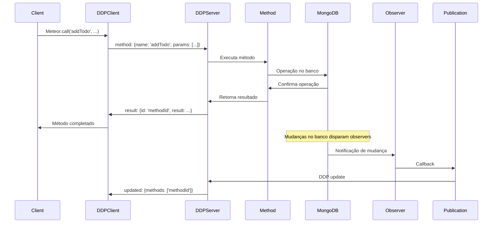

#### Processamento de Métodos no Servidor:

```javascript
// Exemplo de processamento de método no servidor
async function processMethod(msg, unblock) {
  // Configura fence para marcar método como satisfeito
  const fence = new DDPServer._WriteFence;
  fence.onAllCommitted(() => {
    fence.retire();
    self.send({msg: 'updated', methods: [msg.id]});
  });

  // Encontra o handler do método
  const handler = self.server.method_handlers[msg.method];
  
  // Cria invocação do método
  const invocation = new DDPCommon.MethodInvocation({
    name: msg.method,
    isSimulation: false,
    userId: self.userId,
    unblock: unblock,
    connection: self.connectionHandle,
    fence,
  });

  // Executa o método
  const result = await handler.call(invocation, ...msg.params);
  
  // Envia resultado
  self.send({
    msg: 'result',
    id: msg.id,
    result: result
  });
}
```

## 4. Fluxo Completo de Dados

### 4.1 Cenário: Usuário adiciona um novo item todo

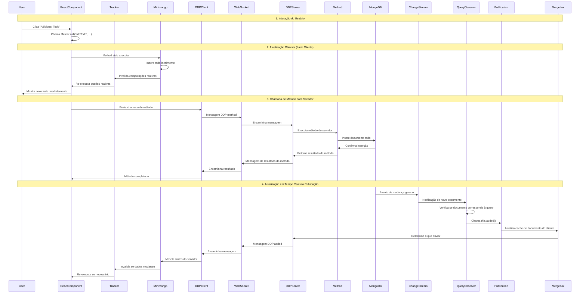

### 4.2 Processamento de Mensagens no Cliente

```javascript
// Exemplo de processamento de mensagens no cliente
async function processDataMessage(msg) {
  const messageType = msg.msg;

  switch (messageType) {
    case 'added':
      await this._connection._process_added(msg, updates);
      break;
    case 'changed':
      this._connection._process_changed(msg, updates);
      break;
    case 'removed':
      this._connection._process_removed(msg, updates);
      break;
    case 'ready':
      this._connection._process_ready(msg, updates);
      break;
    case 'updated':
      this._connection._process_updated(msg, updates);
      break;
  }
}
```

## 5. Estratégias de Publicação

O Meteor oferece diferentes estratégias de publicação para otimizar performance:

### 5.1 SERVER_MERGE (Padrão)

O servidor mantém uma cópia de todos os dados que uma conexão está inscrita, permitindo enviar apenas deltas:

```javascript
// Estratégia padrão
Meteor.publish('todos', function() {
  return Todos.find({ userId: this.userId });
});
```

### 5.2 NO_MERGE_NO_HISTORY

O servidor envia todos os dados da publicação diretamente para o cliente sem lembrar o que foi enviado:

```javascript
// Para casos especiais como filas send-and-forget
Meteor.publish('notifications', function() {
  return Notifications.find({ userId: this.userId });
}, { strategy: 'NO_MERGE_NO_HISTORY' });
```

### 5.3 NO_MERGE

Similar ao NO_MERGE_NO_HISTORY mas o servidor lembra os IDs enviados:

```javascript
// Para collections usadas em uma única publicação
Meteor.publish('userProfile', function() {
  return UserProfiles.find({ userId: this.userId });
}, { strategy: 'NO_MERGE' });
```

## 6. Otimizações e Considerações de Performance

### 6.1 Reutilização de Observers

Observers são componentes caros. O Meteor reutiliza observers quando queries são idênticas:

```javascript
// Queries idênticas reutilizam o mesmo observer
Meteor.publish('todos', function() {
  return Todos.find({ userId: this.userId });
});

Meteor.publish('todos', function() {
  return Todos.find({ userId: this.userId }); // Mesmo observer
});
```

### 6.2 Buffering de Mensagens

O cliente pode bufferizar mensagens para reduzir overhead de rede:

```javascript
// Configuração de buffering
DDP.connect('ws://localhost:3000', {
  bufferedWritesInterval: 100, // Buffer por 100ms
  bufferedWritesMaxAge: 1000   // Máximo 1 segundo
});
```

### 6.3 Compensação de Latência

O Meteor implementa compensação de latência para melhor experiência do usuário:

```javascript
// Stub de método no cliente
Meteor.methods({
  'addTodo': function(text) {
    // Executa imediatamente no cliente
    Todos.insert({ text, createdAt: new Date() });
  }
});
```

## 7. Tratamento de Erros e Reconexão

### 7.1 Reconexão Automática

O DDP Client automaticamente reconecta quando a conexão é perdida:

```javascript
// Configuração de reconexão
DDP.connect('ws://localhost:3000', {
  retryCount: 5,
  retryDelay: 1000
});
```

### 7.2 Recuperação de Estado

Após reconexão, o cliente recupera seu estado:

```javascript
// Recuperação de subscriptions
Meteor.subscribe('todos', { onReady: () => {
  console.log('Subscription ready');
}});
```

## 8. Segurança e Validação

### 8.1 Validação de Argumentos

Métodos devem validar argumentos de entrada:

```javascript
Meteor.methods({
  'addTodo': function(text) {
    check(text, String);
    // ... resto do método
  }
});
```

### 8.2 Controle de Acesso

Publicações devem verificar permissões:

```javascript
Meteor.publish('todos', function() {
  if (!this.userId) {
    return this.ready();
  }
  return Todos.find({ userId: this.userId });
});
```

## 9. Debugging e Monitoramento Avançado

### 9.1 Logs DDP

Ativar logs DDP para debugging:

```javascript
// No cliente
Meteor._debug = true;

// No servidor
Meteor._debug = true;
```

### 9.2 Métricas de Performance

Monitorar métricas importantes:

```javascript
// Número de observers ativos
console.log('Active observers:', DDPServer._allSubs.size);

// Número de conexões
console.log('Active connections:', DDPServer._allConnections.size);
```


### 9.4 Comandos de Debugging Úteis

```javascript
// Verificar estado geral do sistema
function inspectMeteorState() {
  console.log('=== Meteor State Inspection ===');
  
  // Conexões
  console.log('Active connections:', DDPServer.sessions.size);
  
  // Publications
  console.log('Registered publications:', Object.keys(DDPServer.publish_handlers));
  
  // Methods
  console.log('Registered methods:', Object.keys(DDPServer.method_handlers));
  
  // Observers
  console.log('Active observers:', DDPServer._allSubs ? DDPServer._allSubs.size : 'N/A');
  
  // Memory
  if (typeof process !== 'undefined') {
    const mem = process.memoryUsage();
    console.log('Memory usage:', {
      rss: `${Math.round(mem.rss / 1024 / 1024)}MB`,
      heapUsed: `${Math.round(mem.heapUsed / 1024 / 1024)}MB`,
      heapTotal: `${Math.round(mem.heapTotal / 1024 / 1024)}MB`
    });
  }
}

// Verificar sessão específica
function inspectSession(sessionId) {
  const session = DDPServer.sessions.get(sessionId);
  if (!session) {
    console.log('Session not found:', sessionId);
    return;
  }
  
  console.log('=== Session Details ===');
  console.log('ID:', session.id);
  console.log('User ID:', session.userId);
  console.log('Subscriptions:', session._subscriptions.size);
  console.log('Methods:', session._methods.size);
  
  if (session.mergebox) {
    const stats = session.mergebox.getStats();
    console.log('Mergebox stats:', stats);
  }
}

// Verificar publication específica
function inspectPublication(name) {
  const handler = DDPServer.publish_handlers[name];
  if (!handler) {
    console.log('Publication not found:', name);
    return;
  }
  
  console.log('=== Publication Details ===');
  console.log('Name:', name);
  console.log('Handler:', handler.toString().slice(0, 200) + '...');
  
  // Conta subscriptions ativas
  let activeSubs = 0;
  DDPServer.sessions.forEach(session => {
    session._subscriptions.forEach(sub => {
      if (sub.name === name) activeSubs++;
    });
  });
  
  console.log('Active subscriptions:', activeSubs);
}

// Verificar método específico
function inspectMethod(name) {
  const handler = DDPServer.method_handlers[name];
  if (!handler) {
    console.log('Method not found:', name);
    return;
  }
  
  console.log('=== Method Details ===');
  console.log('Name:', name);
  console.log('Handler:', handler.toString().slice(0, 200) + '...');
}

// Limpar recursos
function cleanupResources() {
  console.log('=== Cleaning up resources ===');
  
  // Para observers órfãos
  let stoppedObservers = 0;
  // Implementação para parar observers órfãos
  
  // Limpa sessions inativas
  let closedSessions = 0;
  DDPServer.sessions.forEach((session, id) => {
    if (session.socket.readyState === WebSocket.CLOSED) {
      session.close();
      closedSessions++;
    }
  });
  
  console.log(`Stopped ${stoppedObservers} observers, closed ${closedSessions} sessions`);
}
```

## Conclusão

O fluxo de dados do Meteor é um sistema complexo mas elegante que combina:

1. **Reatividade Transparente** através do Tracker
2. **Cache Local Inteligente** com Minimongo
3. **Comunicação em Tempo Real** via DDP
4. **Detecção de Mudanças Eficiente** com Observers
5. **Otimizações de Performance** com Mergebox e estratégias de publicação

Este sistema permite que desenvolvedores criem aplicações em tempo real sem se preocupar com a complexidade da sincronização de dados, focando apenas na lógica de negócio e experiência do usuário.

O Meteor abstrai toda essa complexidade em uma API simples e intuitiva, permitindo que desenvolvedores criem aplicações sofisticadas com menos código e mais confiabilidade.

## 10. Considerações para Manutenção

### 10.1 Pontos de Atenção Críticos

#### Memory Leaks Comuns:

1. **Observers não parados**: Observers criados em publications devem ser parados quando a subscription é cancelada
2. **Subscriptions órfãs**: Subscriptions que não são canceladas quando componentes são desmontados
3. **Mergebox crescente**: Cache do servidor que não é limpo adequadamente
4. **Event listeners**: Listeners de eventos que não são removidos

#### Performance Bottlenecks:

1. **Queries ineficientes**: Queries que não usam índices adequados
2. **Publications muito amplas**: Publications que enviam mais dados do que necessário
3. **Métodos síncronos**: Métodos que bloqueiam o event loop
4. **Reatividade excessiva**: Computações que re-executam desnecessariamente

### 10.2 Checklist de Manutenção

#### Diário:
- [ ] Verificar logs de erro
- [ ] Monitorar uso de memória
- [ ] Verificar conexões ativas
- [ ] Analisar métricas de performance

#### Semanal:
- [ ] Revisar observers ativos
- [ ] Verificar subscriptions órfãs
- [ ] Analisar slow queries
- [ ] Revisar publications

#### Mensal:
- [ ] Auditoria completa de memory leaks
- [ ] Análise de performance
- [ ] Revisão de código crítico
- [ ] Atualização de dependências

### 10.3 Ferramentas de Monitoramento em Produção

```javascript
// Configuração de monitoramento em produção
if (process.env.NODE_ENV === 'production') {
  // Monitoramento de performance
  const performanceMonitor = new PerformanceDetector();
  
  // Detecção de memory leaks
  const memoryLeakDetector = new MemoryLeakDetector();
  
  // Métricas do sistema
  const systemMonitor = new MeteorMonitor();
  
  // Alertas automáticos
  setInterval(() => {
    const report = systemMonitor.generateReport();
    
    if (report.metrics.connections > 1000) {
      console.error('High connection count detected');
      // Enviar alerta
    }
    
    if (report.metrics.observers > 500) {
      console.error('High observer count detected');
      // Enviar alerta
    }
  }, 60000);
}
```

### 10.6 Otimizações Recomendadas

#### Para Performance:
1. **Use índices adequados** no MongoDB
2. **Limite dados em publications** usando `fields` e `limit`
3. **Use `unblock()`** em métodos longos
4. **Implemente paginação** para grandes datasets
5. **Use `Tracker.nonreactive()`** quando apropriado

#### Para Memória:
1. **Pare observers** explicitamente
2. **Limpe subscriptions** quando componentes são desmontados
3. **Use `NO_MERGE` strategy** para publications únicas
4. **Implemente cleanup** em publications customizadas
5. **Monitore memory usage** regularmente

#### Para Escalabilidade:
1. **Use Redis Oplog** para múltiplos servidores
2. **Implemente rate limiting** em métodos
3. **Use load balancing** para distribuir carga
4. **Monitore métricas** de performance
5. **Implemente circuit breakers** para operações críticas

### 10.7 Documentação de Manutenção

Mantenha documentação atualizada sobre:
- Configurações específicas do ambiente
- Procedures de troubleshooting
- Contatos de emergência
- Runbooks para problemas comuns
- Métricas e alertas configurados

Esta documentação deve ser revisada regularmente e atualizada conforme o sistema evolui. 
