# Complete Data Flow in Meteor: From Client to Server and Back

## Introduction

Meteor is known for its real-time data architecture that enables automatic synchronization between client and server. In this comprehensive guide, we'll analyze the complete data flow from when a client sends data to the server until that data is distributed to all connected clients.

## Overall System Architecture

Meteor uses a layered architecture that includes:


## 1. Client Layer

### 1.1 User Interface (UI)

The user interface is where everything begins. When a user interacts with the application (for example, clicks a button to add a todo), the UI triggers an action that initiates the data flow.

#### Internal Implementation:

```javascript
// Example of how the UI triggers the flow
// In a React component
const handleAddTodo = () => {
  // This call initiates the entire data flow
  Meteor.call('addTodo', { text: 'New todo' }, (error, result) => {
    if (error) {
      console.error('Error adding todo:', error);
    }
  });
};
```

### 1.2 Tracker - Reactive System

The Tracker is the heart of Meteor's reactive system. It implements **Transparent Reactive Programming**:

```javascript
// Example of how the Tracker works
Tracker.autorun(() => {
  // This computation depends on reactive data sources
  const user = Meteor.user();
  const todos = Todos.find({ userId: user?._id });
  
  // The UI updates automatically when user or todos change
  updateUI(todos.fetch());
});
```

#### Real Tracker Implementation:

The Tracker is implemented in `packages/tracker/tracker.js`:

<details>
<summary>🔍 View complete Tracker implementation</summary>

```javascript
// Real Computation structure (packages/tracker/tracker.js)
Tracker.Computation = class Computation {
  constructor(f, parent, onError) {
    if (! constructingComputation)
      throw new Error(
        "Tracker.Computation constructor is private; use Tracker.autorun");
    constructingComputation = false;

    this.stopped = false;
    this.invalidated = false;
    this.firstRun = true;

    this._id = nextId++;
    this._onInvalidateCallbacks = [];
    this._onStopCallbacks = [];
    // the plan is at some point to use the parent relation
    // to constrain the order that computations are processed
    this._parent = parent;
    this._func = f;
    this._onError = onError;
    this._recomputing = false;

    /**
     * @summary Forces autorun blocks to be executed in synchronous-looking order by storing the value autorun promise thus making it awaitable.
     */
    this.firstRunPromise = undefined;

    var errored = true;
    try {
      this._compute();
      errored = false;
    } finally {
      this.firstRun = false;
      if (errored)
        this.stop();
    }
  }

  invalidate() {
    if (! this.invalidated) {
      // if we're currently in _recompute(), don't enqueue
      // ourselves, since we'll rerun immediately anyway.
      if (! this._recomputing && ! this.stopped) {
        requireFlush();
        pendingComputations.push(this);
      }

      this.invalidated = true;

      // callbacks can't add callbacks, because
      // this.invalidated === true.
      for(var i = 0, f; f = this._onInvalidateCallbacks[i]; i++) {
        Tracker.nonreactive(() => {
          withNoYieldsAllowed(f)(this);
        });
      }
      this._onInvalidateCallbacks = [];
    }
  }

  stop() {
    if (! this.stopped) {
      this.stopped = true;
      this.invalidate();
      for(var i = 0, f; f = this._onStopCallbacks[i]; i++) {
        Tracker.nonreactive(() => {
          withNoYieldsAllowed(f)(this);
        });
      }
      this._onStopCallbacks = [];
    }
  }

  _compute() {
    this.invalidated = false;

    var previousInCompute = inCompute;
    inCompute = true;

    try {
      // In case of async functions, the result of this function will contain the promise of the autorun function
      // & make autoruns await-able.
      const firstRunPromise = Tracker.withComputation(this, () => {
        return withNoYieldsAllowed(this._func)(this);
      });
      // We'll store the firstRunPromise on the computation so it can be awaited by the callers, but only
      // during the first run. We don't want things to get mixed up.
      if (this.firstRun) {
        this.firstRunPromise = Promise.resolve(firstRunPromise);
      }
    } finally {
      inCompute = previousInCompute;
    }
  }
};

// Real Tracker.autorun implementation
Tracker.autorun = function (f, options = {}) {
  if (typeof f !== 'function')
    throw new Error('Tracker.autorun requires a function argument');

  constructingComputation = true;
  var c = new Tracker.Computation(f, Tracker.currentComputation, options.onError);

  if (Tracker.active)
    Tracker.onInvalidate(function () {
      c.stop();
    });

  return c;
};
```

</details>

#### How Tracker Works:

1. **Computation Creation**: When you call `Tracker.autorun()`, it creates a `Computation` object
2. **Dependency Tracking**: During execution, reactive data sources register dependencies
3. **Invalidation**: When data changes, dependencies trigger computation invalidation
4. **Recomputation**: Invalidated computations automatically re-execute

#### Tracker Architecture:


### 1.3 Minimongo - Client Local Cache

Minimongo is a JavaScript implementation of MongoDB that runs in the browser. It serves as a local cache for data:

#### Key Features:

- **Synchronous API**: Queries return immediately from local cache
- **MongoDB Compatibility**: Same API as server-side MongoDB
- **Optimistic Updates**: Changes applied locally first, then synchronized
- **Latency Compensation**: Users see changes instantly

#### Real Minimongo Implementation:

Minimongo is implemented in `packages/minimongo/local_collection.js`:

<details>
<summary>🔍 View complete LocalCollection implementation</summary>

```javascript
// Real LocalCollection structure (packages/minimongo/local_collection.js)
export default class LocalCollection {
  constructor(name) {
    this.name = name;
    // _id -> document (also containing id)
    this._docs = new LocalCollection._IdMap;

    this._observeQueue = Meteor.isClient
      ? new Meteor._SynchronousQueue()
      : new Meteor._AsynchronousQueue();

    this.next_qid = 1; // live query id generator

    // qid -> live query object. keys:
    //  ordered: bool. ordered queries have addedBefore/movedBefore callbacks.
    //  results: array (ordered) or object (unordered) of current results
    //    (aliased with this._docs!)
    //  resultsSnapshot: snapshot of results. null if not paused.
    //  cursor: Cursor object for the query.
    //  selector, sorter, (callbacks): functions
    this.queries = Object.create(null);

    // null if not saving originals; an IdMap from id to original document value
    // if saving originals. See comments before saveOriginals().
    this._savedOriginals = null;

    // True when observers are paused and we should not send callbacks.
    this.paused = false;
  }

  // options may include sort, skip, limit, reactive
  find(selector, options) {
    // default syntax for everything is to omit the selector argument.
    // but if selector is explicitly passed in as false or undefined, we
    // want a selector that matches nothing.
    if (arguments.length === 0) {
      selector = {};
    }

    return new LocalCollection.Cursor(this, selector, options);
  }

  findOne(selector, options = {}) {
    if (arguments.length === 0) {
      selector = {};
    }

    // NOTE: by setting limit 1 here, we end up using very inefficient
    // code that recomputes the whole query on each update. The upside is
    // that when you reactively depend on a findOne you only get
    // invalidated when the found object changes, not any object in the
    // collection. Most findOne will be by id, which has a fast path, so
    // this might not be a big deal. In most cases, invalidation causes
    // the called to re-query anyway, so this should be a net performance
    // improvement.
    options.limit = 1;

    return this.find(selector, options).fetch()[0];
  }

  prepareInsert(doc) {
    assertHasValidFieldNames(doc);

    // if you really want to use ObjectIDs, set this global.
    // Mongo.Collection specifies its own ids and does not use this code.
    if (!hasOwn.call(doc, '_id')) {
      doc._id = LocalCollection._useOID ? new MongoID.ObjectID() : Random.id();
    }

    const id = doc._id;

    if (this._docs.has(id)) {
      throw MinimongoError(`Duplicate _id '${id}'`);
    }

    this._saveOriginal(id, undefined);
    this._docs.set(id, doc);

    return id;
  }

  // XXX possibly enforce that 'undefined' does not appear (we assume
  // this in our handling of null and $exists)
  insert(doc, callback) {
    doc = EJSON.clone(doc);
    const id = this.prepareInsert(doc);
    const queriesToRecompute = [];

    // trigger live queries that match
    for (const qid of Object.keys(this.queries)) {
      const query = this.queries[qid];

      if (query.dirty) {
        continue;
      }

      const matchResult = query.matcher.documentMatches(doc);

      if (matchResult.result) {
        if (query.distances && matchResult.distance !== undefined) {
          query.distances.set(id, matchResult.distance);
        }

        if (query.cursor.skip || query.cursor.limit) {
          queriesToRecompute.push(qid);
        } else {
          LocalCollection._insertInResultsSync(query, doc);
        }
      }
    }

    queriesToRecompute.forEach(qid => {
      if (this.queries[qid]) {
        this._recomputeResults(this.queries[qid]);
      }
    });

    this._observeQueue.drain();

    // Defer because the caller likely doesn't expect the callback to be run
    // immediately if it's passed.
    if (callback) {
      Meteor.defer(() => {
        callback(null, id);
      });
    }

    return id;
  }
}
```

</details>

#### Minimongo Architecture:


#### Optimistic UI Flow:

```mermaid
sequenceDiagram
    participant User
    participant UI
    participant Minimongo
    participant Connection
    participant Server
    participant MongoDB
    
    User->>UI: Clicks "Add Todo"
    UI->>Minimongo: todos.insert(newTodo)
    Minimongo->>UI: Immediate update (optimistic)
    UI->>User: Shows new todo instantly
    
    Minimongo->>Connection: Sends method call
    Connection->>Server: Mensagem DDP method
    Server->>MongoDB: Insere documento
    MongoDB->>Server: Confirma inserção
    Server->>Connection: Method result
    Server->>Connection: Updated data via subscription
    Connection->>Minimongo: Reconcile changes
    
    Note over Minimongo: If server data differs,
    Note over Minimongo: local changes are corrected
```



### 1.4 DDP Client

The DDP Client manages communication with the server through the DDP (Distributed Data Protocol) protocol.

#### Real Implementation of DDP Client:

The DDP Client is implemented in `packages/ddp-client/common/livedata_connection.js`:

<details>
<summary>🔍 See complete Connection implementation</summary>

```javascript
// Real Connection structure (packages/ddp-client/common/livedata_connection.js)
export class Connection {
  constructor(url, options) {
    const self = this;

    this.options = options = {
      onConnected() {},
      onDDPVersionNegotiationFailure(description) {
        Meteor._debug(description);
      },
      heartbeatInterval: 17500,
      heartbeatTimeout: 15000,
      npmFayeOptions: Object.create(null),
      // These options are only for testing.
      reloadWithOutstanding: false,
      supportedDDPVersions: DDPCommon.SUPPORTED_DDP_VERSIONS,
      retry: true,
      respondToPings: true,
      // When updates are coming within this ms interval, batch them together.
      bufferedWritesInterval: 5,
      // Flush buffers immediately if writes are happening continuously for more than this many ms.
      bufferedWritesMaxAge: 500,

      ...options
    };

    // If set, called when we reconnect, queuing method calls _before_ the
    // existing outstanding ones.
    // NOTE: This feature has been preserved for backwards compatibility. The
    // preferred method of setting a callback on reconnect is to use
    // DDP.onReconnect.
    self.onReconnect = null;

    // as a test hook, allow passing a stream instead of a url.
    if (typeof url === 'object') {
      self._stream = url;
    } else {
      const { ClientStream } = require("meteor/socket-stream-client");

      self._stream = new ClientStream(url, {
        retry: options.retry,
        ConnectionError: DDP.ConnectionError,
        headers: options.headers,
        _sockjsOptions: options._sockjsOptions,
        // Used to keep some tests quiet, or for other cases in which
        // the right thing to do with connection errors is to silently
        // fail (e.g. sending package usage stats). At some point we
        // should have a real API for handling client-stream-level
        // errors.
        _dontPrintErrors: options._dontPrintErrors,
        connectTimeoutMs: options.connectTimeoutMs,
        npmFayeOptions: options.npmFayeOptions
      });
    }

    self._lastSessionId = null;
    self._versionSuggestion = null; // The last proposed DDP version.
    self._version = null; // The DDP version agreed on by client and server.
    self._stores = Object.create(null); // name -> object with methods
    self._methodHandlers = Object.create(null); // name -> func
    self._nextMethodId = 1;
    self._supportedDDPVersions = options.supportedDDPVersions;

    self._heartbeatInterval = options.heartbeatInterval;
    self._heartbeatTimeout = options.heartbeatTimeout;

    // Tracks methods which the user has tried to call but which have not yet
    // called their user callback (ie, they are waiting on their result or for all
    // of their writes to be written to the local cache). Map from method ID to
    // MethodInvoker object.
    self._methodInvokers = Object.create(null);

    // Tracks methods which the user has called but whose result messages have not
    // arrived yet.
    self._outstandingMethodBlocks = [];

    // method ID -> array of objects with keys 'collection' and 'id', listing
    // documents written by a given method's stub. keys are associated with
    // methods whose stub wrote at least one document, and whose data-done message
    // has not yet been received.
    self._documentsWrittenByStub = {};
    // collection -> IdMap of "server document" object. A "server document" has:
    // - "document": the version of the document according the
    //   server (ie, the snapshot before a stub wrote it, amended by any changes
    //   received from the server)
    //   It is undefined if we think the document does not exist
    // - "writtenByStubs": a set of method IDs whose stubs wrote to the document
    //   whose "data done" messages have not yet been processed
    self._serverDocuments = {};

    // Array of callbacks to be called after the next update of the local
    // cache. Used for:
    //  - Calling methodInvoker.dataVisible and sub ready callbacks after
    //    the relevant data is flushed.
    //  - Invoking the callbacks of "half-finished" methods after reconnect
    //    quiescence. Specifically, methods whose result was received over the old
    //    connection (so we don't re-send it) but whose data had not been made
    //    visible.
    self._afterUpdateCallbacks = [];

    // This buffers the messages that aren't being processed yet.
    self._messagesBufferedUntilQuiescence = [];
    // Map from method ID -> true. Methods are removed from this when their
    // "data done" message is received, and we will not quiesce until it is
    // empty.
    self._methodsBlockingQuiescence = {};
    // map from sub ID -> true for subs that were ready (ie, called the sub
    // ready callback) before reconnect but haven't become ready again yet
    self._subsBeingRevived = {}; // map from sub._id -> true
    // if true, the next data update should reset all stores. (set during
    // reconnect.)
    self._resetStores = false;

    // name -> array of updates for (yet to be created) collections
    self._updatesForUnknownStores = {};
  }
}
```

</details>

## 2. DDP Protocol - Real-time Communication

DDP is Meteor's real-time communication protocol that enables bidirectional communication between client and server.

### 2.1 DDP Message Types

#### Mensagens de Subscription:
- `sub`: Client subscribes to a publication
- `unsub`: Client cancels subscription
- `ready`: Server indicates that subscription is ready
- `nosub`: Server indicates that subscription stopped

#### Data Messages:
- `added`: Document was added to subscription
- `changed`: Document was modified
- `removed`: Document was removed

#### Method Messages:
- `method`: Client calls a server method
- `result`: Server returns method result
- `updated`: Server confirms that all writes are complete

### 2.2 DDP Flow Example:


## 3. Server Layer

### 3.1 DDP Server

The DDP Server is responsible for:

- Managing WebSocket connections
- Process DDP messages
- Coordinating between methods and publications
- Maintain connection state

#### Real Implementation of DDP Server:

The DDP Server is implemented in `packages/ddp-server/livedata_server.js`:

<details>
<summary>🔍 See complete Session implementation</summary>

```javascript
// Real Session structure (packages/ddp-server/livedata_server.js)
var Session = function (server, version, socket, options) {
  var self = this;
  self.id = Random.id();

  self.server = server;
  self.version = version;

  self.initialized = false;
  self.socket = socket;

  // Set to null when the session is destroyed. Multiple places below
  // use this to determine if the session is alive or not.
  self.inQueue = new Meteor._DoubleEndedQueue();

  self.blocked = false;
  self.workerRunning = false;

  self.cachedUnblock = null;

  // Sub objects for active subscriptions
  self._namedSubs = new Map();
  self._universalSubs = [];

  self.userId = null;

  self.collectionViews = new Map();

  // Set this to false to not send messages when collectionViews are
  // modified. This is done when rerunning subs in _setUserId and those messages
  // are calculated via a diff instead.
  self._isSending = true;

  // If this is true, don't start a newly-created universal publisher on this
  // session. The session will take care of starting it when appropriate.
  self._dontStartNewUniversalSubs = false;

  // When we are rerunning subscriptions, any ready messages
  // we want to buffer up for when we are done rerunning subscriptions
  self._pendingReady = [];

  // List of callbacks to call when this connection is closed.
  self._closeCallbacks = [];

  // XXX HACK: If a sockjs connection, save off the URL. This is
  // temporary and will go away in the near future.
  self._socketUrl = socket.url;

  // Allow tests to disable responding to pings.
  self._respondToPings = options.respondToPings;

  // This object is the public interface to the session. In the public
  // API, it is called the `connection` object.  Internally we call it
  // a `connectionHandle` to avoid ambiguity.
  self.connectionHandle = {
    id: self.id,
    close: function () {
      self.close();
    },
    onClose: function (fn) {
      var cb = Meteor.bindEnvironment(fn, "connection onClose callback");
      if (self.inQueue) {
        self._closeCallbacks.push(cb);
      } else {
        // if we're already closed, call the callback.
        Meteor.defer(cb);
      }
    },
    clientAddress: self._clientAddress(),
    httpHeaders: self.socket.headers
  };

  self.send({ msg: 'connected', session: self.id });

  // On initial connect, spin up all the universal publishers.
  self.startUniversalSubs();

  if (version !== 'pre1' && options.heartbeatInterval !== 0) {
    // We no longer need the low level timeout because we have heartbeats.
    socket.setWebsocketTimeout(0);

    self.heartbeat = new DDPCommon.Heartbeat({
      heartbeatInterval: options.heartbeatInterval,
      heartbeatTimeout: options.heartbeatTimeout,
      onTimeout: function () {
        self.close();
      },
      sendPing: function () {
        self.send({msg: 'ping'});
      }
    });
    self.heartbeat.start();
  }

  Package['facts-base'] && Package['facts-base'].Facts.incrementServerFact(
    "livedata", "sessions", 1);
};

Object.assign(Session.prototype, {
  sendReady: function (subscriptionIds) {
    var self = this;
    if (self._isSending) {
      self.send({msg: "ready", subs: subscriptionIds});
    } else {
      subscriptionIds.forEach(function (subscriptionId) {
        self._pendingReady.push(subscriptionId);
      });
    }
  },

  _canSend(collectionName) {
    return this._isSending || !this.server.getPublicationStrategy(collectionName).useCollectionView;
  },

  sendAdded(collectionName, id, fields) {
    if (this._canSend(collectionName)) {
      this.send({ msg: 'added', collection: collectionName, id, fields });
    }
  },

  sendChanged(collectionName, id, fields) {
    if (this._canSend(collectionName)) {
      this.send({ msg: 'changed', collection: collectionName, id, fields });
    }
  }
});
```

</details>

### 3.2 Publications

**Publications** are functions on the server that **define** which data can be sent to clients. **Subscriptions** are **specific instances** of these publications for each connected client.

#### Difference between Publication and Subscription:

```javascript
// 1. PUBLICATION - Definition on server (once)
Meteor.publish('todos', function() {
  // This is the publication DEFINITION
  return Todos.find({ userId: this.userId });
});

// 2. SUBSCRIPTION - Instance per client (many)
// Client A calls:
Meteor.subscribe('todos'); // Creates Subscription 1 for Client A

// Client B calls:
Meteor.subscribe('todos'); // Creates Subscription 2 for Client B

// Client A calls again:
Meteor.subscribe('todos'); // Creates Subscription 3 for Client A
```

#### Relationship:

```mermaid
graph TB
    subgraph "Server"
        PublicationFunction["🎯 Publication Function<br/>'todos' (Definition)"]
    end
    
    subgraph "Per Connected Client"
        ClientA[👤 Client A]
        ClientB[👤 Client B]
        ClientC[👤 Client C]
        
        SubA1[📡 Subscription A1<br/>todos]
        SubA2[📡 Subscription A2<br/>todos]
        SubB1[📡 Subscription B1<br/>todos] 
        SubC1[📡 Subscription C1<br/>todos]
    end
    
    PublicationFunction --> SubA1
    PublicationFunction --> SubA2
    PublicationFunction --> SubB1
    PublicationFunction --> SubC1
    
    ClientA --> SubA1
    ClientA --> SubA2
    ClientB --> SubB1
    ClientC --> SubC1
```



#### Lifecycle: Publication → Subscription

When a client calls `Meteor.subscribe()`, the following happens:


#### Real Code - How Publications Become Subscriptions:

<details>
<summary>🔍 See complete Subscription processing implementation</summary>

```javascript
// No DDP Server (packages/ddp-server/livedata_server.js)

// 1. REGISTRO da Publication (server startup)
// Real Server class structure
var Server = function (options) {
  var self = this;
  self.publish_handlers = {};  // ← Objeto que armazena as functions das publications
  self.universal_publish_handlers = [];
};

// Real Meteor.publish function
Server.prototype.publish = function (name, handler, options) {
  var self = this;
  if (name)
    self.publish_handlers[name] = handler;  // ← Stores the publication FUNCTION
  else
    self.universal_publish_handlers.push(handler);
};

// 2. CREATION of Subscription (for each client)
// Real processing of 'sub' message 
function processSubMessage(msg) {
  // Finds the handler function in the publish_handlers object
  var handler = self.server.publish_handlers[msg.name];
  
  if (!handler) {
    this.sendReady([msg.id]);
    return;
  }
  
  // Creates an INSTANCE of the subscription for this specific client
  var subscription = new Subscription(
    this,           // session (client connection)
    handler,        // the publication function
    msg.id,         // unique id of this subscription
    msg.params,     // parameters passed by the client
    msg.name        // nome da publication
  );
  
  // Each subscription is independent
  this._namedSubs.set(msg.id, subscription);
  
  // Executes the publication function in the context of this subscription
  subscription._runHandler();
}
```

</details>

#### Real Implementation of Publications and Subscriptions:

Publications are implemented in `packages/ddp-server/livedata_server.js`:

<details>
<summary>🔍 See complete Subscription implementation</summary>

```javascript
// Real Subscription structure (packages/ddp-server/livedata_server.js)
var Subscription = function (
    session, handler, subscriptionId, params, name) {
  var self = this;
  self._session = session; // type is Session

  /**
   * @summary Access inside the publish function. The incoming [connection](#meteor_onconnection) for this subscription.
   * @locus Server
   * @name  connection
   * @memberOf Subscription
   * @instance
   */
  self.connection = session.connectionHandle; // public API object

  self._handler = handler;

  // My subscription ID (generated by client, undefined for universal subs).
  self._subscriptionId = subscriptionId;
  // Undefined for universal subs
  self._name = name;

  self._params = params || [];

  // Only named subscriptions have IDs, but we need some sort of string
  // internally to keep track of all subscriptions inside
  // SessionDocumentViews. We use this subscriptionHandle for that.
  if (self._subscriptionId) {
    self._subscriptionHandle = 'N' + self._subscriptionId;
  } else {
    self._subscriptionHandle = 'U' + Random.id();
  }

  // Has _deactivate been called?
  self._deactivated = false;

  // Stop callbacks to g/c this sub.  called w/ zero arguments.
  self._stopCallbacks = [];

  // The set of (collection, documentid) that this subscription has
  // an opinion about.
  self._documents = new Map();

  // Remember if we are ready.
  self._ready = false;

  // Part of the public API: the user of this sub.
  self.userId = session.userId;

  self._idFilter = {
    idStringify: MongoID.idStringify,
    idParse: MongoID.idParse
  };

  Package['facts-base'] && Package['facts-base'].Facts.incrementServerFact(
    "livedata", "subscriptions", 1);
};

Object.assign(Subscription.prototype, {
  _runHandler: async function() {
    // XXX should we unblock() here? Either before running the publish
    // function, or before running _publishCursor.
    //
    // Right now, each publish function blocks all future publishes and
    // methods waiting on data from Mongo (or whatever else the function
    // blocks on). This probably slows page load in common cases.

    if (!this.unblock) {
      this.unblock = () => {};
    }

    const self = this;
    let resultOrThenable = null;
    try {
      resultOrThenable = DDP._CurrentPublicationInvocation.withValue(
        self,
        () =>
          maybeAuditArgumentChecks(
            self._handler,
            self,
            EJSON.clone(self._params),
            // It's OK that this would look weird for universal subscriptions,
            // because they have no arguments so there can never be an
            // audit-argument-checks failure.
            "publisher '" + self._name + "'"
          ),
        { name: self._name }
      );
    } catch (e) {
      self.error(e);
      return;
    }

    // Did the handler call this.error or this.stop?
    if (self._isDeactivated()) return;

    // Both conventional and async publish handler functions are supported.
    // If an object is returned with a then() function, it is either a promise
    // or thenable and will be resolved asynchronously.
    const isThenable =
      resultOrThenable && typeof resultOrThenable.then === 'function';
    if (isThenable) {
      try {
        await self._publishHandlerResult(await resultOrThenable);
      } catch(e) {
        self.error(e)
      }
    } else {
      await self._publishHandlerResult(resultOrThenable);
    }
  },

  /**
   * @summary Call inside the publish function.  Informs the subscriber that a document has been added to the record set.
   */
  added (collectionName, id, fields) {
    if (this._isDeactivated())
      return;
    id = this._idFilter.idStringify(id);

    if (this._session.server.getPublicationStrategy(collectionName).doAccountingForCollection) {
      let ids = this._documents.get(collectionName);
      if (ids == null) {
        ids = new Set();
        this._documents.set(collectionName, ids);
      }
      ids.add(id);
    }

    this._session.added(this._subscriptionHandle, collectionName, id, fields);
  },

  /**
   * @summary Call inside the publish function.  Informs the subscriber that a document in the record set has been modified.
   */
  changed (collectionName, id, fields) {
    if (this._isDeactivated())
      return;
    id = this._idFilter.idStringify(id);
    this._session.changed(this._subscriptionHandle, collectionName, id, fields);
  },

  /**
   * @summary Call inside the publish function.  Informs the subscriber that a document has been removed from the record set.
   */
  removed (collectionName, id) {
    if (this._isDeactivated())
      return;
    id = this._idFilter.idStringify(id);

    if (this._session.server.getPublicationStrategy(collectionName).doAccountingForCollection) {
      // We don't bother to delete sets of things in a collection if the
      // collection is empty.  It could break _removeAllDocuments.
      this._documents.get(collectionName).delete(id);
    }

    this._session.removed(this._subscriptionHandle, collectionName, id);
  },

  /**
   * @summary Call inside the publish function.  Informs the subscriber that an initial, complete snapshot of the record set has been sent.
   */
  ready: function () {
    var self = this;
    if (self._isDeactivated())
      return;
    if (!self._subscriptionId)
      return;  // Unnecessary but ignored for universal sub
    if (!self._ready) {
      self._session.sendReady([self._subscriptionId]);
      self._ready = true;
    }
  }
});
```

</details>

#### Practical Example: Publication vs Subscription

To clarify the difference, here is a complete example:

```javascript
// SERVER - DEFINING THE PUBLICATION (once)
Meteor.publish('userTodos', function(userId) {
  console.log('📚 Publication executed for:', this.userId, 'params:', userId);
  
  // This function will be executed for EACH subscription
  return Todos.find({ 
    userId: userId || this.userId 
  });
});

// CLIENT A - CREATING SUBSCRIPTIONS (multiple instances)
const sub1 = Meteor.subscribe('userTodos', 'user123');
const sub2 = Meteor.subscribe('userTodos', 'user456');

// CLIENT B - CREATING MORE SUBSCRIPTIONS
const sub3 = Meteor.subscribe('userTodos', 'user123'); // Same data as sub1!

// RESULT ON SERVER:
// - 1 Publication Function: 'userTodos'
// - 3 Subscription Instances: one for each subscribe()
// - Each Subscription executes the function independently
// - ObserveMultiplexer otimiza: sub1 e sub3 reutilizam o mesmo Observer!
```

#### Server State:

<details>
<summary>🔍 See complete server internal state</summary>

```javascript
// Real internal server state after subscriptions:
// Structure based on code in packages/ddp-server/livedata_server.js

{
  // Classe Server (DDPServer)
  server: {
    publish_handlers: {  // ← Objeto real que armazena as functions
      'userTodos': function(userId) { /* the publication function */ }
    },
    universal_publish_handlers: [],
    sessions: new Map()  // ← Real Map of active sessions
  },
  
  // Each individual Session
  session_clientA: {
    _namedSubs: new Map([  // ← Real Map of subscriptions per session
      ['sub1', new Subscription(session, handler, 'sub1', ['user123'], 'userTodos')],
      ['sub2', new Subscription(session, handler, 'sub2', ['user456'], 'userTodos')]
    ])
  },
  
  session_clientB: {
    _namedSubs: new Map([
      ['sub3', new Subscription(session, handler, 'sub3', ['user123'], 'userTodos')]
    ])
  },
  
  // MongoConnection (packages/mongo/mongo_connection.js)
  mongoConnection: {
    _observeMultiplexers: {  // ← Object real que otimiza queries idênticas
      'todos_{"userId":"user123"}': /* ObserveMultiplexer shared between sub1 and sub3 */,
      'todos_{"userId":"user456"}': /* ObserveMultiplexer exclusive for sub2 */
    }
  }
}
```

</details>

### 3.3 ObserveMultiplexer e ObserveHandle

#### Resumo: Publication ≠ Subscription

| **Publication** | **Subscription** |
|----------------|------------------|
| 🎯 **Definition** - A function | 📡 **Instance** - Created object |
| 📝 Written on server once | 🔄 Created for each `Meteor.subscribe()` |
| 🏭 Template/Mold | 🏠 House built from the mold |
| 📚 Cake recipe | 🍰 Cake made from the recipe |
| ⚡ `Meteor.publish('name', fn)` | ⚡ `Meteor.subscribe('name')` |
| 🔍 Defines WHICH data | 📦 Sends data to ONE client |
| 💾 Stored in `publicationHandlers` | 💾 Stored in `session._namedSubs` |

```javascript
// 1 Publication → N Subscriptions
// Real structure in Meteor code:

// server.publish_handlers['todos'] = function() {...}  ← 1 defined function
Meteor.subscribe('todos');      // Subscription 1
Meteor.subscribe('todos');      // Subscription 2  
Meteor.subscribe('todos');      // Subscription 3
```

Between Publications and Observers there is an important abstraction layer: the **ObserveMultiplexer** and **ObserveHandle**.

#### 3.3.1 ObserveMultiplexer

The ObserveMultiplexer is responsible for optimizing identical queries. When multiple subscriptions make the same query, only one Observer is created and the multiplexer distributes the results to all interested handles.

#### Real Implementation of ObserveMultiplexer:

<details>
<summary>🔍 See complete ObserveMultiplexer implementation</summary>

```typescript
// Real ObserveMultiplexer structure (packages/mongo/observe_multiplex.ts)

// Real interface defined in code
interface ObserveMultiplexerOptions {
  ordered: boolean;
  onStop?: () => void;
}

export class ObserveMultiplexer {
  private readonly _ordered: boolean;
  private readonly _onStop: () => void;
  private _queue: any;
  private _handles: { [key: string]: ObserveHandle } | null;
  private _resolver: ((value?: unknown) => void) | null;
  private readonly _readyPromise: Promise<boolean | void>;
  private _isReady: boolean;
  private _cache: any;
  private _addHandleTasksScheduledButNotPerformed: number;

  constructor({ ordered, onStop = () => {} }: ObserveMultiplexerOptions) {
    if (ordered === undefined) throw Error("must specify ordered");

    this._ordered = ordered;
    this._onStop = onStop;
    this._queue = new Meteor._AsynchronousQueue();
    this._handles = {};
    this._resolver = null;
    this._isReady = false;
    this._readyPromise = new Promise(r => this._resolver = r).then(() => this._isReady = true);
    this._cache = new LocalCollection._CachingChangeObserver({ ordered });
    this._addHandleTasksScheduledButNotPerformed = 0;

    // Registra callbacks dinamicamente (added, changed, removed)
    this.callbackNames().forEach(callbackName => {
      (this as any)[callbackName] = (...args: any[]) => {
        this._applyCallback(callbackName, args);
      };
    });
  }

  async addHandleAndSendInitialAdds(handle: ObserveHandle): Promise<void> {
    ++this._addHandleTasksScheduledButNotPerformed;

    await this._queue.runTask(async () => {
      this._handles![handle._id] = handle;
      await this._sendAdds(handle);
      --this._addHandleTasksScheduledButNotPerformed;
    });
    await this._readyPromise;
  }

  async removeHandle(id: number): Promise<void> {
    if (!this._ready())
      throw new Error("Can't remove handles until the multiplex is ready");

    delete this._handles![id];

    if (isEmpty(this._handles) &&
      this._addHandleTasksScheduledButNotPerformed === 0) {
      await this._stop();
    }
  }

  // Método chamado pelos Observers (OplogObserveDriver, ChangeStreamObserveDriver, etc)
  _applyCallback(callbackName: string, args: any[]) {
    this._queue.queueTask(async () => {
      if (!this._handles) return;

      // Atualiza cache interno
      await this._cache.applyChange[callbackName].apply(null, args);
      
      if (!this._ready() &&
        (callbackName !== 'added' && callbackName !== 'addedBefore')) {
        throw new Error(`Got ${callbackName} during initial adds`);
      }

      // Distributes to all registered handles
      for (const handleId of Object.keys(this._handles)) {
        const handle = this._handles && this._handles[handleId];
        if (!handle) return;

        const callback = (handle as any)[`_${callbackName}`];
        if (!callback) continue;

        handle.initialAddsSent.then(callback.apply(
          null,
          handle.nonMutatingCallbacks ? args : EJSON.clone(args)
        ))
      }
    });
  }
}
```

</details>

#### 3.3.2 ObserveHandle

The ObserveHandle connects a specific subscription to the multiplexer, providing the callbacks that will be called when data changes.

#### Creation and Usage Flow:

```mermaid
graph TB
    subgraph "Publication"
        CursorObserveChanges[cursor.observeChanges()]
        PublicationCallbacks[sub.added/changed/removed]
    end
    
    subgraph "Multiplexer Layer"
        ObserveHandle[ObserveHandle]
        ObserveMultiplexer[ObserveMultiplexer]
        CachingObserver[CachingChangeObserver]
    end
    
    subgraph "Observer Layer"
        OplogDriver[OplogObserveDriver]
        ChangeStreamDriver[ChangeStreamObserveDriver]
        PollingDriver[PollingObserveDriver]
    end
    
    subgraph "Database"
        MongoDB[(MongoDB)]
    end
    
    CursorObserveChanges --> ObserveHandle
    ObserveHandle --> ObserveMultiplexer
    ObserveMultiplexer --> CachingObserver
    ObserveMultiplexer --> OplogDriver
    ObserveMultiplexer --> ChangeStreamDriver
    ObserveMultiplexer --> PollingDriver
    
    OplogDriver --> MongoDB
    ChangeStreamDriver --> MongoDB
    PollingDriver --> MongoDB
    
    MongoDB --> OplogDriver
    MongoDB --> ChangeStreamDriver
    MongoDB --> PollingDriver
    
    OplogDriver --> ObserveMultiplexer
    ChangeStreamDriver --> ObserveMultiplexer
    PollingDriver --> ObserveMultiplexer
    
    ObserveMultiplexer --> ObserveHandle
    ObserveHandle --> PublicationCallbacks
```

#### How optimization works:

<details>
<summary>🔍 See complete observer optimization example</summary>

```javascript
// Real example of how multiple subscriptions reuse the same observer
// No arquivo mongo_connection.js

// First subscription for todos with userId: 'abc'
const observeKey1 = EJSON.stringify({
  ordered: false,
  collectionName: 'todos',
  selector: { userId: 'abc' },
  options: {}
});

// Segunda subscription idêntica - reutiliza o mesmo multiplexer!
const observeKey2 = EJSON.stringify({
  ordered: false,
  collectionName: 'todos', 
  selector: { userId: 'abc' },
  options: {}
});

// observeKey1 === observeKey2, então apenas um Observer é criado
if (observeKey in self._observeMultiplexers) {
  multiplexer = self._observeMultiplexers[observeKey]; // Reutiliza!
} else {
  // Cria novo multiplexer apenas se não existir
  multiplexer = new ObserveMultiplexer({
    ordered: ordered,
    onStop: function () {
      delete self._observeMultiplexers[observeKey];
      return observeDriver.stop();
    }
  });
}
```

</details>

### 3.4 Observers

**Observers** are the heart of Meteor's data synchronization system. They monitor changes in MongoDB and notify the ObserveMultiplexer about these changes.

#### Real Implementation of Observers:

Meteor implements different observation drivers, each in its own file:

<details>
<summary>🔍 See complete OplogObserveDriver implementation</summary>

**OplogObserveDriver** (`packages/mongo/oplog_observe_driver.js`):
```javascript
// Real OplogObserveDriver structure
export const OplogObserveDriver = function (options) {
  const self = this;
  self._usesOplog = true;  // tests look at this

  self._id = currentId;
  currentId++;

  self._cursorDescription = options.cursorDescription;
  self._mongoHandle = options.mongoHandle;
  self._multiplexer = options.multiplexer;

  if (options.ordered) {
    throw Error("OplogObserveDriver only supports unordered observeChanges");
  }

  const sorter = options.sorter;
  // We don't support $near and other geo-queries so it's OK to initialize the
  // comparator only once in the constructor.
  const comparator = sorter && sorter.getComparator();

  if (options.cursorDescription.options.limit) {
    // There are several properties ordered driver implements:
    // - _limit is a positive number
    // - _comparator is a function-comparator by which the query is ordered
    // - _unpublishedBuffer is non-null Min/Max Heap,
    //                      the empty buffer in STEADY phase implies that the
    //                      everything that matches the queries selector fits
    //                      into published set.
    // - _published - Max Heap (also implements IdMap methods)

    const heapOptions = { IdMap: LocalCollection._IdMap };
    self._limit = self._cursorDescription.options.limit;
    self._comparator = comparator;
    self._sorter = sorter;
    self._unpublishedBuffer = new MinMaxHeap(comparator, heapOptions);
    // We need something that can find Max value in addition to IdMap interface
    self._published = new MaxHeap(comparator, heapOptions);
  } else {
    self._limit = 0;
    self._comparator = null;
    self._sorter = null;
    self._unpublishedBuffer = null;
    // Memory Growth
    self._published = new LocalCollection._IdMap;
  }

  // Indicates if it is safe to insert a new document at the end of the buffer
  // for this query. i.e. it is known that there are no documents matching the
  // selector those are not in published or buffer.
  self._safeAppendToBuffer = false;

  self._stopped = false;
  self._stopHandles = [];
};
```

</details>

<details>
<summary>🔍 See complete ChangeStreamObserveDriver implementation</summary>

**ChangeStreamObserveDriver** (`packages/mongo/changestream_observe_driver.js`):
```javascript
// Real ChangeStreamObserveDriver structure
export class ChangeStreamObserveDriver {
  constructor(options) {
    const self = this;
    
    this._usesChangeStreams = true;
    this._cursorDescription = options.cursorDescription;
    this._mongoHandle = options.mongoHandle;
    this._multiplexer = options.multiplexer;
    this._ordered = options.ordered;
    this._changeStream = null;
    this._stopped = false;
    this._stopCallbacks = [];
    this._pendingWrites = [];
    this._writesToCommitWhenReady = [];
    this._isReady = false;
    this._lastProcessedOperationTime = null;
    
    // Use the matcher passed from mongo_connection.js
    this._matcher = options.matcher;
    
    // Fallback: create matcher if not provided
    if (!this._matcher) {
      // Import Minimongo locally to avoid circular dependencies
      const { Minimongo } = require('meteor/minimongo');
      this._matcher = new Minimongo.Matcher(this._cursorDescription.selector);
    }
    
    // For debugging
    this._id = options.id || Random.id();
    
    // Projection function similar to oplog driver
    const projection = this._cursorDescription.options.projection || this._cursorDescription.options.fields;
    if (projection) {
      this._projectionFn = LocalCollection._compileProjection(projection);
    } else {
      this._projectionFn = (doc) => {
        if (typeof doc._id.toHexString === 'function') {
          doc._id = new MongoID.ObjectID(doc._id.toHexString());
        }
        return doc;
      }
    }
    
    this._startListening();
    this._startWatching();
  }

  // TODO: should we delete the _id field from the document before sending it to the multiplexer?
  async _sendMultiplexerAdded(id, projectedDoc) {
     delete projectedDoc._id;
     this._multiplexer.added(id, projectedDoc);
  }
  
  async _startListening() {
    const self = this;
    
    // Register a listener to be notified when writes happen
    // This follows the same pattern as OplogObserveDriver
    const stopHandle = await listenAll(
      self._cursorDescription,
      function () {
        // If we're not in a pre-fire write fence, we don't have to do anything.
        const fence = DDPServer._getCurrentFence();
        if (!fence || fence.fired)
          return;
        
        if (fence._changeStreamObserveDrivers) {
          fence._changeStreamObserveDrivers[self._id] = self;
          return;
        }
        
        fence._changeStreamObserveDrivers = {};
        fence._changeStreamObserveDrivers[self._id] = self;
        
        fence.onBeforeFire(async function () {
          const drivers = fence._changeStreamObserveDrivers;
          delete fence._changeStreamObserveDrivers;
          
          // Process each driver that needs to be synchronized with the fence
          for (const driver of Object.values(drivers)) {
            if (driver._stopped) continue;
            
            const write = await fence.beginWrite();
            
            // Process pending writes that occurred during the method
            await driver._writesToCommitWhenReady.forEach(async (write) => {
              await driver._handleWrite(write);
            });
            
            driver._writesToCommitWhenReady = [];
            write.committed();
          }
        });
      }
    );
    
    this._stopCallbacks.push(stopHandle);
  }

  stop() {
    if (this._stopped) return;
    this._stopped = true;
    
    if (this._changeStream) {
      this._changeStream.close();
    }
    
    this._stopCallbacks.forEach(callback => callback());
  }
}
```

</details>

<details>
<summary>🔍 See complete PollingObserveDriver implementation</summary>

**PollingObserveDriver** (`packages/mongo/polling_observe_driver.ts`):
```typescript
// Real PollingObserveDriver structure
export class PollingObserveDriver {
  constructor(
    private options: {
      cursorDescription: CursorDescription;
      mongoHandle: any;
      multiplexer: any;
      ordered: boolean;
    }
  ) {
    this._cursorDescription = options.cursorDescription;
    this._mongoHandle = options.mongoHandle;
    this._stopped = false;
    this._synchronousCursor = options.cursorDescription.options.synchronousCursor;
    this._multiplexer = options.multiplexer;
    this._ordered = options.ordered;
    this._matcher = options.cursorDescription.matcher;
    this._pollInterval = options.cursorDescription.options.pollingIntervalMs || 10000;
    this._pollTimeoutMs = options.cursorDescription.options.pollingTimeoutMs;

    // previous results snapshot.  on each poll cycle, diffs against
    // results and sends out added/changed/removed messages appropriately.
    this._results = options.ordered ? [] : new LocalCollection._IdMap();

    // The number of completed polls. On the first poll, _pollsCompletedCount
    // will be incremented to 1. We use this to determine if a result in the
    // _results is stale or fresh.
    this._pollsCompletedCount = 0;

    // Number of completed polls that are allowed to take place serially before
    // yielding.
    this._noYieldsAllowed = 20;

    this._everPolledSuccessfully = false;

    this._startPolling();
  }

  async _startPolling() {
    while (!this._stopped) {
      try {
        await this._poll();
        await this._sleep(this._pollInterval);
      } catch (error) {
        console.error('Polling error:', error);
        await this._sleep(this._pollInterval);
      }
    }
  }

  async _poll() {
    if (this._stopped) return;
    
    try {
      const newResults = await this._synchronousCursor.getRawObjects(this._ordered);
      this._publishNewResults(newResults);
    } catch (error) {
      console.error('Poll error:', error);
    }
  }

  _publishNewResults(newResults: any) {
    // Compare with previous results and send appropriate messages
    if (this._ordered) {
      this._diffOrderedResults(newResults);
    } else {
      this._diffUnorderedResults(newResults);
    }
    
    this._results = newResults;
    this._pollsCompletedCount++;
  }

  stop() {
    if (this._stopped) return;
    this._stopped = true;
  }

  private async _sleep(ms: number): Promise<void> {
    return new Promise(resolve => setTimeout(resolve, ms));
  }
}
```

</details>

#### 3.3.1 OplogObserveDriver (Default)

Uses MongoDB's oplog to detect changes in real time:


#### Fluxo de Processamento do Oplog:

```mermaid
sequenceDiagram
    participant App
    participant MongoDB
    participant OplogTail
    participant OplogObserver
    participant QueryObserver
    participant Publication
    participant Client
    
    App->>MongoDB: Insert/Update/Delete
    MongoDB->>MongoDB: Escreve no oplog
    OplogTail->>MongoDB: Tail oplog cursor
    MongoDB->>OplogTail: Entrada do oplog
    OplogTail->>OplogObserver: Processa entrada
    OplogObserver->>QueryObserver: Verifica se afeta query
    alt Query afetada
        QueryObserver->>ObserveMultiplexer: multiplexer.added/changed/removed()
        ObserveMultiplexer->>ObserveHandle: Distribui para handles
        ObserveHandle->>Publication: Dispara callbacks (added/changed/removed)
        Publication->>Client: Envia atualização DDP
    end
```



#### Processamento de Entrada do Oplog:

<details>
<summary>🔍 Ver exemplo completo de entrada do oplog</summary>

```javascript
// Exemplo de entrada do oplog para um insert
{
  "ts": ...,           // Timestamp
  "t": ...,            // Term
  "h": ...,            // Hash
  "v": 2,              // Version
  "op": "i",           // Tipo de operação (i=insert, u=update, d=delete)
  "ns": "myapp.todos", // Namespace (database.collection)
  "o": {               // Documento da operação
    "_id": ObjectId("..."),
    "text": "New todo",
    "done": false
  }
}
```

</details>

#### 3.3.2 ChangeStreamObserveDriver

Modern MongoDB feature (3.6+) that provides real-time change notifications:


#### 3.3.3 PollingObserveDriver

Fallback that does periodic polling of the database:


### 3.5 SessionCollectionView - Cache per Client on Server

The SessionCollectionView (what was called Mergebox in the original blog) maintains a cache of what each client received, enabling efficient delta updates:

```mermaid
graph TB
    subgraph "Server Memory"
        SessionCollectionView[SessionCollectionView]
        ClientCache[Client Cache]
        DocumentCache[Document Cache]
    end
    
    subgraph "Conexões"
        Connection1[Connection 1]
        Connection2[Connection 2]
        ConnectionN[Connection N]
    end
    
    SessionCollectionView --> ClientCache
    ClientCache --> DocumentCache
    
    Connection1 --> SessionCollectionView
    Connection2 --> SessionCollectionView
    ConnectionN --> SessionCollectionView
```



#### Real Implementation of SessionCollectionView:

SessionCollectionView is implemented in `packages/ddp-server/session_collection_view.ts`:

<details>
<summary>🔍 See complete SessionCollectionView implementation</summary>

```typescript
// Real SessionCollectionView structure (packages/ddp-server/session_collection_view.ts)

// Real interface defined in code
interface SessionCallbacks {
  added: (collectionName: string, id: string, fields: Record<string, any>) => void;
  changed: (collectionName: string, id: string, fields: Record<string, any>) => void;
  removed: (collectionName: string, id: string) => void;
}

// Real type defined in code
type DocumentView = SessionDocumentView | DummyDocumentView;

export class SessionCollectionView {
  private readonly collectionName: string;
  private readonly documents: Map<string, DocumentView>;
  private readonly callbacks: SessionCallbacks;

  /**
   * Represents a client's view of a single collection
   * @param collectionName - Name of the collection it represents
   * @param sessionCallbacks - The callbacks for added, changed, removed
   */
  constructor(collectionName: string, sessionCallbacks: SessionCallbacks) {
    this.collectionName = collectionName;
    this.documents = new Map();
    this.callbacks = sessionCallbacks;
  }

  public isEmpty(): boolean {
    return this.documents.size === 0;
  }

  public diff(previous: SessionCollectionView): void {
    DiffSequence.diffMaps(previous.documents, this.documents, {
      both: this.diffDocument.bind(this),
      rightOnly: (id: string, nowDV: DocumentView) => {
        this.callbacks.added(this.collectionName, id, nowDV.getFields());
      },
      leftOnly: (id: string, prevDV: DocumentView) => {
        this.callbacks.removed(this.collectionName, id);
      }
    });
  }

  private diffDocument(id: string, prevDV: DocumentView, nowDV: DocumentView): void {
    const fields: Record<string, any> = {};
    
    DiffSequence.diffObjects(prevDV.getFields(), nowDV.getFields(), {
      both: (key: string, prev: any, now: any) => {
        if (!EJSON.equals(prev, now)) {
          fields[key] = now;
        }
      },
      rightOnly: (key: string, now: any) => {
        fields[key] = now;
      },
      leftOnly: (key: string, prev: any) => {
        fields[key] = undefined;
      }
    });
    
    this.callbacks.changed(this.collectionName, id, fields);
  }

  public added(subscriptionHandle: string, id: string, fields: Record<string, any>): void {
    let docView: DocumentView | undefined = this.documents.get(id);
    let added = false;

    if (!docView) {
      added = true;
      if (Meteor.server.getPublicationStrategy(this.collectionName).useDummyDocumentView) {
        docView = new DummyDocumentView();
      } else {
        docView = new SessionDocumentView();
      }
      this.documents.set(id, docView);
    }

    docView.existsIn.add(subscriptionHandle);
    const changeCollector: Record<string, any> = {};

    Object.entries(fields).forEach(([key, value]) => {
      docView!.changeField(
        subscriptionHandle,
        key,
        value,
        changeCollector,
        true
      );
    });

    if (added) {
      this.callbacks.added(this.collectionName, id, changeCollector);
    } else {
      this.callbacks.changed(this.collectionName, id, changeCollector);
    }
  }

  public changed(subscriptionHandle: string, id: string, changed: Record<string, any>): void {
    const changedResult: Record<string, any> = {};
    const docView = this.documents.get(id);
    
    if (!docView) {
      throw new Error(`Could not find element with id ${id} to change`);
    }

    Object.entries(changed).forEach(([key, value]) => {
      docView.changeField(subscriptionHandle, key, value, changedResult, false);
    });

    this.callbacks.changed(this.collectionName, id, changedResult);
  }

  public removed(subscriptionHandle: string, id: string): void {
    const docView = this.documents.get(id);
    
    if (!docView) {
      const subscriptions = [...docView?.existsIn || []];
      throw new Error(`Removed nonexistent document ${id} from subscription ${subscriptionHandle}. Existing subscriptions: ${subscriptions.join(', ')}`);
    }

    docView.existsIn.delete(subscriptionHandle);
    
    if (docView.existsIn.size === 0) {
      this.callbacks.removed(this.collectionName, id);
      this.documents.delete(id);
    } else {
      const changedFields: Record<string, any> = {};
      
      // Remove this subscription from all fields in the document
      docView.clearField(subscriptionHandle, changedFields);
      
      this.callbacks.changed(this.collectionName, id, changedFields);
    }
  }
}
```

</details>

### 3.6 Methods (Métodos)

Methods are remote functions that clients can invoke. They are the main mechanism for writing data.

#### Ciclo de Vida do Método:

```mermaid
sequenceDiagram
    participant Client
    participant Connection
    participant Server
    participant Method
    participant MongoDB
    
    Client->>Connection: Meteor.call('addTodo', ...)
    Connection->>Server: method: {name: 'addTodo', params: [...]}
    Server->>Method: Executa método
    Method->>MongoDB: Operação no banco
    MongoDB->>Method: Confirma operação
    Method->>Server: Retorna resultado
    Server->>Connection: result: {id: 'methodId', result: ...}
    Connection->>Client: Método completado
    
    Note over MongoDB: Mudanças no banco disparam observers
    MongoDB->>Observer: Notificação de mudança
    Observer->>ObserveMultiplexer: multiplexer.added/changed/removed()
    ObserveMultiplexer->>ObserveHandle: Distribui para handles
    ObserveHandle->>Publication: Callback (added/changed/removed)
    Publication->>Server: DDP update
    Server->>Connection: updated: {methods: ['methodId']}
```



#### Real Method Processing on Server:

<details>
<summary>🔍 See complete method processing implementation</summary>

```javascript
// Real method processing implementation (packages/ddp-server/livedata_server.js)
async function processMethod(msg, unblock) {
  // Sets up fence to mark method as satisfied
  const fence = new DDPServer._WriteFence;
  fence.onAllCommitted(() => {
    fence.retire();
    self.send({msg: 'updated', methods: [msg.id]});
  });

  // Finds the method handler
  const handler = self.server.method_handlers[msg.method];
  
  // Creates method invocation
  const invocation = new DDPCommon.MethodInvocation({
    name: msg.method,
    isSimulation: false,
    userId: self.userId,
    unblock: unblock,
    connection: self.connectionHandle,
    fence,
  });

  // Executes the method
  const result = await handler.call(invocation, ...msg.params);
  
  // Sends result
  self.send({
    msg: 'result',
    id: msg.id,
    result: result
  });
}
```

</details>

## 4. Complete Data Flow

### 4.1 Scenario: User adds a new todo item

```mermaid
sequenceDiagram
    participant User
    participant ReactComponent
    participant Tracker
    participant Minimongo
    participant Connection
    participant WebSocket
    participant Server
    participant Method
    participant MongoDB
    participant ChangeStream
    participant QueryObserver
    participant Publication
    participant Mergebox
    
    Note over User, Mergebox: 1. User Interaction
    User->>ReactComponent: Clicks "Add Todo"
    ReactComponent->>ReactComponent: Calls Meteor.call('addTodo', ...)
    
    Note over User, Mergebox: 2. Optimistic Update (Client Side)
    ReactComponent->>Minimongo: Method stub executes
    Minimongo->>Minimongo: Inserts todo locally
    Minimongo->>Tracker: Invalidates reactive computations
    Tracker->>ReactComponent: Re-executes reactive queries
    ReactComponent->>User: Shows new todo immediately
    
    Note over User, Mergebox: 3. Method Call to Server
    ReactComponent->>Connection: Sends method call
    Connection->>WebSocket: DDP method message
    WebSocket->>Server: Forwards message
    Server->>Method: Executes server method
    Method->>MongoDB: Inserts todo document
    MongoDB->>Method: Confirms insertion
    Method->>Server: Returns method result
    Server->>WebSocket: Method result message
    WebSocket->>Connection: Forwards result
    Connection->>ReactComponent: Method completed
    
    Note over User, Mergebox: 4. Real-time Update via Publication
    MongoDB->>ChangeStream: Evento de mudança gerado
    ChangeStream->>QueryObserver: Notificação de novo documento
    QueryObserver->>QueryObserver: Verifica se documento corresponde à query
    QueryObserver->>ObserveMultiplexer: multiplexer.added()
    ObserveMultiplexer->>ObserveHandle: Distribui para handle
    ObserveHandle->>Publication: Chama this.added()
    Publication->>Mergebox: Atualiza cache de documento do cliente
    Mergebox->>Server: Determina o que enviar
    Server->>WebSocket: Mensagem DDP added
    WebSocket->>Connection: Encaminha mensagem
    Connection->>Minimongo: Merges server data
    Minimongo->>Tracker: Invalida se dados mudaram
    Tracker->>ReactComponent: Re-executa se necessário
```



### 4.2 Processamento de Mensagens no Cliente

<details>
<summary>🔍 Ver exemplo completo de processamento de mensagens DDP</summary>

```javascript
// Exemplo de processamento de mensagens no cliente
async function processDataMessage(msg) {
  const messageType = msg.msg;

  switch (messageType) {
    case 'added':
      await this._connection._process_added(msg, updates);
      break;
    case 'changed':
      this._connection._process_changed(msg, updates);
      break;
    case 'removed':
      this._connection._process_removed(msg, updates);
      break;
    case 'ready':
      this._connection._process_ready(msg, updates);
      break;
    case 'updated':
      this._connection._process_updated(msg, updates);
      break;
  }
}
```

</details>

## 5. Publication Strategies

Meteor offers different publication strategies to optimize performance:

### 5.1 SERVER_MERGE (Default)

The server maintains a copy of all data that a connection is subscribed to, allowing it to send only deltas:

```javascript
// Default strategy
Meteor.publish('todos', function() {
  return Todos.find({ userId: this.userId });
});
```

### 5.2 NO_MERGE_NO_HISTORY

The server sends all publication data directly to the client without remembering what was sent:

```javascript
// For special cases like send-and-forget queues
Meteor.publish('notifications', function() {
  return Notifications.find({ userId: this.userId });
}, { strategy: 'NO_MERGE_NO_HISTORY' });
```

### 5.3 NO_MERGE

Similar ao NO_MERGE_NO_HISTORY mas o servidor lembra os IDs enviados:

```javascript
// For collections used in a single publication
Meteor.publish('userProfile', function() {
  return UserProfiles.find({ userId: this.userId });
}, { strategy: 'NO_MERGE' });
```

## 6. Optimizations and Performance Considerations

### 6.1 Observer Reuse

Observers are expensive components. Meteor reuses observers when queries are identical:

```javascript
// Identical queries reuse the same observer
Meteor.publish('todos', function() {
  return Todos.find({ userId: this.userId });
});

Meteor.publish('todos', function() {
  return Todos.find({ userId: this.userId }); // Same observer
});
```

### 6.2 Message Buffering

The client can buffer messages to reduce network overhead:

```javascript
// Buffering configuration
DDP.connect('ws://localhost:3000', {
  bufferedWritesInterval: 100, // Buffer for 100ms
  bufferedWritesMaxAge: 1000   // Maximum 1 second
});
```

### 6.3 Latency Compensation

Meteor implements latency compensation for better user experience:

```javascript
// Stub de método no cliente
Meteor.methods({
  'addTodo': function(text) {
    // Executes immediately on client
    Todos.insert({ text, createdAt: new Date() });
  }
});
```

## 7. Error Handling and Reconnection

### 7.1 Automatic Reconnection

The DDP Client automatically reconnects when the connection is lost:

```javascript
// Reconnection configuration
DDP.connect('ws://localhost:3000', {
  retryCount: 5,
  retryDelay: 1000
});
```

### 7.2 State Recovery

After reconnection, the client recovers its state:

```javascript
// Subscription recovery
Meteor.subscribe('todos', { onReady: () => {
  console.log('Subscription ready');
}});
```

## 8. Security and Validation

### 8.1 Argument Validation

Methods must validate input arguments:

```javascript
Meteor.methods({
  'addTodo': function(text) {
    check(text, String);
    // ... rest of method
  }
});
```

### 8.2 Access Control

Publications must verify permissions:

```javascript
Meteor.publish('todos', function() {
  if (!this.userId) {
    return this.ready();
  }
  return Todos.find({ userId: this.userId });
});
```

## 9. Debugging e Monitoramento Avançado

### 9.1 Logs DDP

Enable DDP logs for debugging:

```javascript
// No cliente
Meteor._debug = true;

// No servidor
Meteor._debug = true;
```

### 9.2 Performance Metrics

Monitor important metrics:

```javascript
// Number of active observers
console.log('Active observers:', DDPServer._allSubs.size);

// Number of connections
console.log('Active connections:', DDPServer._allConnections.size);
```


### 9.4 Useful Debugging Commands

<details>
<summary>🔍 See complete debugging and monitoring commands</summary>

```javascript
// Check general system state
function inspectMeteorState() {
  console.log('=== Meteor State Inspection ===');
  
  // Conexões
  console.log('Active connections:', DDPServer.sessions.size);
  
  // Publications
  console.log('Registered publications:', Object.keys(DDPServer.publish_handlers));
  
  // Methods
  console.log('Registered methods:', Object.keys(DDPServer.method_handlers));
  
  // Observers
  console.log('Active observers:', DDPServer._allSubs ? DDPServer._allSubs.size : 'N/A');
  
  // Memory
  if (typeof process !== 'undefined') {
    const mem = process.memoryUsage();
    console.log('Memory usage:', {
      rss: `${Math.round(mem.rss / 1024 / 1024)}MB`,
      heapUsed: `${Math.round(mem.heapUsed / 1024 / 1024)}MB`,
      heapTotal: `${Math.round(mem.heapTotal / 1024 / 1024)}MB`
    });
  }
}

// Check specific session
function inspectSession(sessionId) {
  const session = DDPServer.sessions.get(sessionId);
  if (!session) {
    console.log('Session not found:', sessionId);
    return;
  }
  
  console.log('=== Session Details ===');
  console.log('ID:', session.id);
  console.log('User ID:', session.userId);
  console.log('Subscriptions:', session._subscriptions.size);
  console.log('Methods:', session._methods.size);
  
  if (session.mergebox) {
    const stats = session.mergebox.getStats();
    console.log('Mergebox stats:', stats);
  }
}

// Check specific publication
function inspectPublication(name) {
  const handler = DDPServer.publish_handlers[name];
  if (!handler) {
    console.log('Publication not found:', name);
    return;
  }
  
  console.log('=== Publication Details ===');
  console.log('Name:', name);
  console.log('Handler:', handler.toString().slice(0, 200) + '...');
  
  // Count active subscriptions
  let activeSubs = 0;
  DDPServer.sessions.forEach(session => {
    session._subscriptions.forEach(sub => {
      if (sub.name === name) activeSubs++;
    });
  });
  
  console.log('Active subscriptions:', activeSubs);
}

// Check specific method
function inspectMethod(name) {
  const handler = DDPServer.method_handlers[name];
  if (!handler) {
    console.log('Method not found:', name);
    return;
  }
  
  console.log('=== Method Details ===');
  console.log('Name:', name);
  console.log('Handler:', handler.toString().slice(0, 200) + '...');
}

// Clean up resources
function cleanupResources() {
  console.log('=== Cleaning up resources ===');
  
  // For orphaned observers
  let stoppedObservers = 0;
  // Implementation to stop orphaned observers
  
  // Clean inactive sessions
  let closedSessions = 0;
  DDPServer.sessions.forEach((session, id) => {
    if (session.socket.readyState === WebSocket.CLOSED) {
      session.close();
      closedSessions++;
    }
  });
  
  console.log(`Stopped ${stoppedObservers} observers, closed ${closedSessions} sessions`);
}
```

</details>

## Note on Implementations

**Important**: This guide has been updated to reflect the real code present in the Meteor repository. All implementations shown are extracted directly from the project's source files, ensuring they faithfully represent how the system works internally.

The main changes from previous versions include:
- Use of TypeScript in some modules (like `SessionCollectionView`)
- Support for async/await functions in publications
- Improvements in class structure and code organization
- Modern implementation of observers with Change Streams

## Conclusion

Meteor's data flow is a complex but elegant system that combines:

1. **Transparent Reactivity** through the Tracker
2. **Intelligent Local Cache** with Minimongo
3. **Real-time Communication** via DDP
4. **Efficient Change Detection** with Observers (OplogObserveDriver, ChangeStreamObserveDriver, PollingObserveDriver)
5. **Client State Management** with SessionCollectionView and SessionDocumentView
6. **Performance Optimizations** with publication strategies

This system allows developers to create real-time applications without worrying about the complexity of data synchronization, focusing only on business logic and user experience.

Meteor abstracts all this complexity into a simple and intuitive API, allowing developers to create sophisticated applications with less code and more reliability.

**All codes presented in this guide were extracted directly from Meteor's official repository**, ensuring they reflect the real implementation of the system. This includes:

- `packages/tracker/tracker.js` - Reactive system
- `packages/minimongo/local_collection.js` - Local cache 
- `packages/ddp-client/common/livedata_connection.js` - DDP Client
- `packages/ddp-server/livedata_server.js` - DDP Server and Subscriptions
- `packages/ddp-server/session_collection_view.ts` - Client state management
- `packages/mongo/oplog_observe_driver.js` - Observer using Oplog
- `packages/mongo/changestream_observe_driver.js` - Observer using Change Streams
- `packages/mongo/polling_observe_driver.ts` - Observer using Polling

## 10. Maintenance Considerations

### 10.1 Critical Points of Attention

#### Common Memory Leaks:

1. **Unstopped observers**: Observers created in publications must be stopped when the subscription is cancelled
2. **Orphaned subscriptions**: Subscriptions that are not cancelled when components are unmounted
3. **Growing mergebox**: Server cache that is not cleaned properly
4. **Event listeners**: Event listeners that are not removed

#### Performance Bottlenecks:

1. **Inefficient queries**: Queries that don't use appropriate indexes
2. **Very broad publications**: Publications that send more data than necessary
3. **Synchronous methods**: Methods that block the event loop
4. **Excessive reactivity**: Computations that re-execute unnecessarily

### 10.2 Maintenance Checklist

#### Daily:
- [ ] Check error logs
- [ ] Monitor memory usage
- [ ] Check active connections
- [ ] Analyze performance metrics

#### Weekly:
- [ ] Review active observers
- [ ] Check orphaned subscriptions
- [ ] Analyze slow queries
- [ ] Review publications

#### Monthly:
- [ ] Complete memory leak audit
- [ ] Performance analysis
- [ ] Critical code review
- [ ] Dependency updates

### 10.3 Production Monitoring Tools

<details>
<summary>🔍 See complete monitoring configuration</summary>

```javascript
// Production monitoring configuration
if (process.env.NODE_ENV === 'production') {
  // Performance monitoring
  const performanceMonitor = new PerformanceDetector();
  
  // Memory leak detection
  const memoryLeakDetector = new MemoryLeakDetector();
  
  // System metrics
  const systemMonitor = new MeteorMonitor();
  
  // Automatic alerts
  setInterval(() => {
    const report = systemMonitor.generateReport();
    
    if (report.metrics.connections > 1000) {
      console.error('High connection count detected');
      // Send alert
    }
    
    if (report.metrics.observers > 500) {
      console.error('High observer count detected');
      // Send alert
    }
  }, 60000);
}
```

</details>

### 10.6 Recommended Optimizations

#### For Performance:
1. **Use appropriate indexes** in MongoDB
2. **Limit data in publications** using `fields` and `limit`
3. **Use `unblock()`** in long methods
4. **Implement pagination** for large datasets
5. **Use `Tracker.nonreactive()`** when appropriate

#### For Memory:
1. **Stop observers** explicitly
2. **Clean up subscriptions** when components are unmounted
3. **Use `NO_MERGE` strategy** for unique publications
4. **Implement cleanup** in custom publications
5. **Monitor memory usage** regularly

#### For Scalability:
1. **Use Redis Oplog** for multiple servers
2. **Implement rate limiting** in methods
3. **Use load balancing** to distribute load
4. **Monitor performance** metrics
5. **Implement circuit breakers** for critical operations

### 10.7 Maintenance Documentation

Keep updated documentation about:
- Environment-specific configurations
- Troubleshooting procedures
- Emergency contacts
- Runbooks for common problems
- Configured metrics and alerts

This documentation should be reviewed regularly and updated as the system evolves. 
